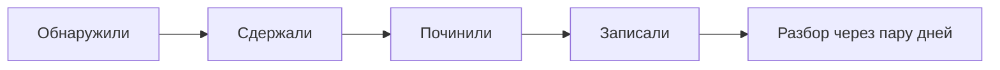

# Инцидент: четыре фазы

## Ситуация

Пришло уведомление: сайт не отвечает. Первая реакция — делать всё сразу. Перезапустить контейнер, заодно почистить диск, заодно проверить файрвол.

Именно так одна авария превращается в две. Классический пример: в спешке трогают настройки доступа и теряют SSH — теперь чинить нечем.

## Зачем это нужно

Нужен короткий ритуал, который не даёт панике управлять руками. Он состоит из четырёх фаз, и порядок в нём важнее скорости.

**1. Обнаружили.** Зафиксируйте время. Не чините первые полминуты — просто запишите, когда началось и что именно видно.

**2. Сдержали.** Задача этой фазы — не сделать хуже. Здесь чаще всего совершают необратимые ошибки.

**3. Починили.** Определили слой по логам (модуль 9) и вылечили именно его.

**4. Записали.** Пять строк, пока помните. Полный разбор будет позже.

### Что можно и что нельзя на фазе сдерживания

| Можно | Нельзя |
|---|---|
| посмотреть панель хостера: включён ли сервер | переустанавливать систему |
| открыть **одну** карточку разбора | менять настройки доступа |
| прочитать логи | чистить диск вслепую |
| проверить состояние контейнеров | менять несколько вещей сразу |

!!! danger "Три команды, которых не должно быть в аварии"
    - удаление томов при остановке контейнеров;
    - агрессивная очистка Docker со всеми данными;
    - повторная настройка файрвола «на всякий случай».

    Каждая из них способна превратить двадцатиминутный простой в потерянный день.

!!! note "Новые слова"
    - **Инцидент** — событие, которое нарушает или вот-вот нарушит обещание перед людьми.
    - **Сдерживание** — действия, не дающие ситуации ухудшиться.
    - **Карточка разбора (runbook)** — готовая шпаргалка с первыми шагами.

## Как это устроено

Пять строк, которые записывают сразу:

1. Начало и конец, с указанием часового пояса.
2. Кто пострадал.
3. Что было видно снаружи.
4. Какой слой оказался виноват и что сделали.
5. Что осталось непонятным.

Это не отчёт для начальства. Это письмо себе через месяц, когда подробности забудутся.

## Практика

### Шаг 1. Приготовить карточки заранее

**Зачем:** искать их во время аварии — значит терять время на ровном месте.

**Где смотреть:** раздел карточек курса. Их три:

- сайт не открывается;
- диск заполнен;
- сертификат истекает.

Откройте каждую и прочитайте вслух как сценарий.

**Что должно получиться:** по каждой вы можете назвать первое действие, не подглядывая.

### Шаг 2. Положить закладку на телефон

**Где делать:** браузер на телефоне.

Сохраните в закладки карточку «сайт не открывается».

**Что должно получиться:** ночью вы открываете её в два касания, а не ищете в переписке.

### Шаг 3. Проверить, что сигнал ведёт к карточке

**Зачем:** сообщение должно подсказывать, куда идти. Иначе фаза сдерживания превращается в импровизацию.

**Где смотреть:** текст, который отправляет ваш скрипт проверки.

**Что должно получиться:** в сообщении упомянута карточка. Если нет — допишите название в текст скрипта.

### Шаг 4. Завести место для записей

Создайте в инвентаре раздел «инциденты» с шаблоном из пяти строк.

**Что должно получиться:** пустая заготовка, которую останется заполнить. Придумывать структуру в момент аварии — плохая идея.

### Шаг 5. Определить, что считать инцидентом

Договоритесь с собой:

| Событие | Инцидент? |
|---|---|
| Сайт не отвечает 20 минут | да |
| Диск заполнен на 86% | нет, утренняя задача |
| Сертификат кончается через 12 дней | нет |
| Одна ошибка в логе | нет |

Важно не занижать планку: если инцидентом считать всё подряд, записи перестанут вестись.

## Проверка

- [ ] Вы знаете четыре фазы по порядку.
- [ ] Можете назвать три действия, запрещённые в аварии.
- [ ] Карточка сохранена в закладках телефона.
- [ ] В инвентаре есть заготовка из пяти строк.
- [ ] Вы определили, что считаете инцидентом.

## Частые ошибки

!!! failure "Чинить, не записывая время"
    Потом невозможно посчитать, сколько бюджета сожжено, и разбор получится приблизительным.

!!! failure "Считать инцидентом каждое предупреждение"
    Предупреждение — задача на утро. Инцидент — когда людям уже плохо.

!!! failure "Починить и забыть"
    Через неделю повторится то же самое, и вы потратите столько же времени.

!!! failure "Открыть три карточки сразу"
    Вы начнёте выполнять шаги вперемешку и не поймёте, что помогло.

## Как это в больших командах

Собирают общий звонок, назначают человека, который руководит разбором, и отдельного — кто пишет хронологию. Для пользователей обновляют страницу состояния сервиса.

Фазы при этом те же четыре. У вас все роли совмещены в одном человеке — именно поэтому порядок особенно важен, иначе они перемешаются.

## Итог

Сдержать, починить по карточке, записать время. Записи нужны для следующего шага — спокойного разбора.

Далее: [Postmortem](03-postmortem.md).

!!! info "Нагрузка на учебный VPS"
    **Нулевая.**
