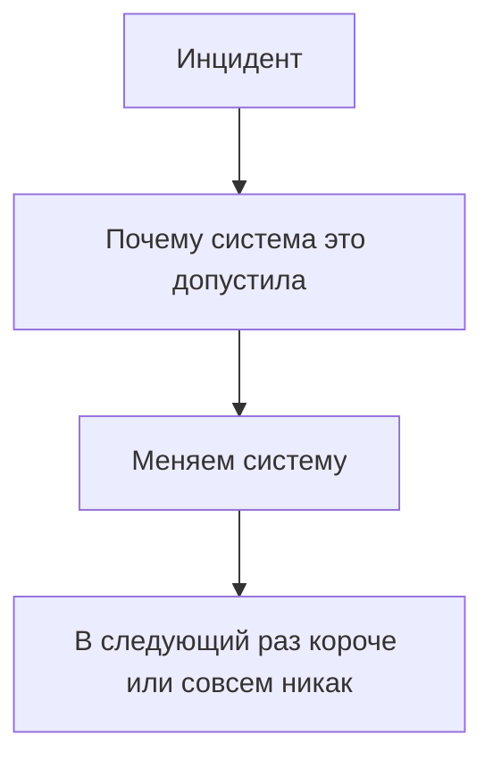

# Postmortem без самобичевания

## Ситуация

Авария закончилась, сайт работает. Вы делаете вывод: «была невнимательна, надо в следующий раз аккуратнее».

Через три недели, уставшая после долгого дня, вы совершите ту же ошибку. Потому что вывод «быть аккуратнее» ничего не изменил — ни в системе, ни в процессе.

## Зачем это нужно

Разбор нужен, чтобы найти **дыру в процессе**, которая позволила аварии случиться, и закрыть именно её.

Слово postmortem звучит мрачно, смысл у него спокойный: короткий текст о том, что было, почему система это допустила и что вы меняете.

Ключевой принцип — **без поиска виноватых**. Это не вежливость, а практический приём. Как только разговор уходит в «кто виноват», поиск настоящей причины прекращается.

Сравните два вывода по одной и той же аварии:

| Вывод | Что изменится |
|---|---|
| «Забыла запустить контейнер обратно» | ничего, забудете снова |
| «Не было уведомления, что сервис лежит» | появится уведомление |
| «Не было привычки проверять состояние после экспериментов» | появится пункт в еженедельном списке |

Второй и третий — рабочие, потому что меняют систему, а не характер.

### Каким должно быть действие

Конкретным, с датой и хозяином:

- плохо: «быть внимательнее»;
- плохо: «настроить мониторинг» — когда и какой?
- хорошо: «включить проверку по расписанию до пятницы».

Хозяин у вас один — вы. Дата всё равно нужна, иначе действие не случится.

!!! note "Новые слова"
    - **Postmortem** — разбор случившегося с выводами о системе.
    - **Разбор без вины (blameless)** — подход, при котором ищут условия, а не виновных.

## Как это устроено



Шаблон на одну страницу — больше не нужно, иначе вы не станете его заполнять:

```markdown
# Инцидент: Пульс не отвечал 20 минут

Когда: 2026-09-25, 16:00–16:20 (Владивосток)
Индикатор: проверка health
Бюджет: сожжено 20 минут из 432

Что видели люди: страница не открывалась, ошибка 502
Как узнали: сообщение в Telegram
Что было на самом деле: контейнер остановлен после эксперимента и не запущен обратно

Почему система это допустила:
- не было привычки проверять состояние после учебных действий
- сигнал приходил, но карточка не была под рукой

Что меняем:
1. Добавить пункт «docker compose ps» в воскресный список — до 29 сентября
2. Дописать ссылку на карточку в текст уведомления — сегодня
```

Обратите внимание: ни слова о характере. Только условия и изменения.

## Практика

### Шаг 1. Взять реальную мелкую беду

**Зачем:** тренироваться лучше на настоящем случае, пусть и небольшом.

Подойдёт любой эпизод из курса: не пускал SSH, кончилось место, неверная запись DNS, забытый перезапуск контейнера.

### Шаг 2. Заполнить шаблон

**Где делать:** файл у себя на компьютере или раздел инвентаря. Не в публичный репозиторий.

Заполните все разделы шаблона выше.

**Что должно получиться:** одна страница текста. Если получилось три — сокращайте, длинный разбор вы не перечитаете.

!!! warning "Не публикуйте разбор с подробностями"
    Адреса серверов, токены, имена файлов с ключами — всё это в публичный текст не попадает.

### Шаг 3. Проверить вывод на пригодность

Задайте своему разделу «что меняем» три вопроса:

- Это конкретное действие или пожелание?
- Есть ли дата?
- Изменится ли что-то в системе, если его выполнить?

**Что должно получиться:** минимум одно действие, проходящее все три проверки.

### Шаг 4. Поставить действие в календарь

**Зачем:** пункт разбора, не попавший в календарь, обычно не выполняется.

**Что должно получиться:** напоминание с датой из вашего разбора.

### Шаг 5. Проверить карточки

**Зачем:** карточки разбора — это и есть накопленный результат прошлых инцидентов.

Перечитайте ту карточку, которая соответствует вашему случаю.

**Что должно получиться:** либо вы убедились, что она помогла, либо нашли в ней неточность и поправили. Второе ценнее.

## Проверка

- [ ] Разбор заполнен и умещается на страницу.
- [ ] В выводах нет слов о характере и внимательности.
- [ ] Есть хотя бы одно конкретное действие с датой.
- [ ] Действие попало в календарь.
- [ ] Карточка проверена и при необходимости уточнена.

## Частые ошибки

!!! failure "Написать разбор на пятнадцать страниц"
    Вы его не откроете, и никто не откроет. Одна страница — это не лень, а требование.

!!! failure "Записать действия без даты"
    Хозяин у вас один, но дата всё равно нужна. Без неё действие откладывается бесконечно.

!!! failure "Не писать разбор из-за стыда"
    Стыд — плохой советчик. Именно поэтому в курсе инцидент устраивается намеренно: тренироваться на учебном случае спокойнее.

!!! failure "Свести вывод к «надо не ошибаться»"
    Это не вывод. Ищите, какая часть процесса позволила ошибке пройти дальше.

## Как это в больших командах

Разбор пишется в общий документ через несколько рабочих дней после события — когда эмоции улеглись, но подробности ещё помнятся. Действия попадают в общий список задач и отслеживаются.

Тон разговора всегда про систему, а не про человека. Вы пишете себе с той же интонацией.

## Итог

Разбор меняет систему. Ваши карточки и уведомления — это уже результаты таких разборов.

Пора устроить учебный пожар и пройти все четыре фазы по правилам.

Далее: [Лаборатория. Учебный инцидент](../../labs/lab-12-uchebnyy-incident.md).

!!! info "Нагрузка на учебный VPS"
    **Короткая остановка контейнера**, как в модуле 11.
