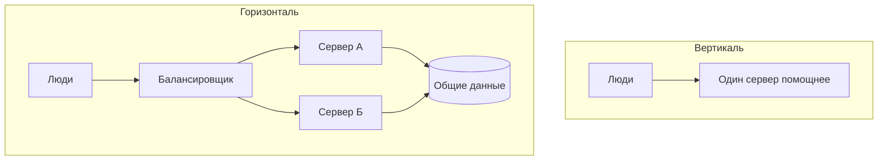

# Вертикально и горизонтально

## Ситуация

Сайту стало тесно: памяти мало, страницы открываются медленнее. В профессиональных чатах на такой вопрос обычно отвечают одним словом — «масштабируйтесь», и дальше следует совет про кластеры.

Между тем есть два разных движения, и они решают разные задачи. Пока вы их не различаете, любой совет обойдётся дорого и, скорее всего, не по адресу.

## Зачем это нужно

**Вертикальное масштабирование** — сделать эту же машину мощнее. Больше памяти, процессора, диска. В панели хостера это выглядит как кнопка «сменить тариф».

**Горизонтальное масштабирование** — поставить несколько одинаковых машин и раздавать людей между ними. Перед ними встаёт балансировщик: программа или услуга хостера, которая распределяет посетителей по живым серверам.

### Чем они отличаются на практике

| | Вертикаль | Горизонталь |
|---|---|---|
| Что делаем | один сервер мощнее | несколько серверов |
| Сложность | кнопка в панели | меняется устройство приложения |
| Потолок | есть, тариф не бесконечен | практически нет |
| Живучесть | машина одна, выключат — всё встало | одна умерла, остальные работают |
| Когда нужно | памяти не хватает | людей много или нужен запас прочности |

### Почему нельзя просто добавить второй сервер

Есть одно препятствие, о котором забывают: **состояние**.

Заметка «Пульса» лежит в файле на диске конкретной машины. Второй сервер этот файл не видит. Человек, попавший на первый сервер, увидит заметку. Попавший на второй — не увидит.

Поэтому горизонтальный рост начинается не с покупки второй машины, а с вопроса: где будут жить общие данные? Варианты — база данных или облачное хранилище файлов.

!!! warning "Кластер эту физику не отменяет"
    Kubernetes не делает файл на локальном диске волшебным образом общим. Там та же проблема решается теми же способами — общим хранилищем.

!!! note "Новые слова"
    - **Балансировщик** — распределяет входящие запросы между несколькими серверами.
    - **Состояние** — данные, которые приложение хранит между запросами.
    - **Общее хранилище** — место, доступное всем серверам сразу.

## Как это устроено



Обратите внимание на нижнюю часть схемы: без общего хранилища горизонталь не работает.

### Правильный порядок для вас

1. Сначала разобраться, чего именно не хватает (следующий урок).
2. Потом вертикаль: 1 ГБ → 2 ГБ.
3. Потом вынести данные в общее место.
4. Только потом вторая машина.

Пока данные лежат в папке на одном диске, честный путь роста — вертикальный.

## Практика

### Шаг 1. Узнать цену следующего шага

**Зачем:** это не призыв покупать. Это цена запасного плана, которую полезно знать заранее.

**Где смотреть:** панель хостера, раздел тарифов.

Найдите стоимость тарифа с 2 ГБ памяти и запишите в инвентарь строку: «вертикальный запас — столько-то рублей в месяц».

**Что должно получиться:** конкретная сумма. Когда сервер начнёт задыхаться, у вас уже будет ответ, сколько стоит его спасти.

### Шаг 2. Проверить, как хостер меняет тариф

**Где смотреть:** там же, описание процедуры смены тарифа.

Обратите внимание на два момента:

- требуется ли перезагрузка (обычно да, на несколько минут);
- можно ли потом вернуться на меньший тариф (не всегда).

**Что должно получиться:** понимание, что смена тарифа — это плановый простой в несколько минут, а не мгновенное действие.

### Шаг 3. Найти своё состояние

**Зачем:** понять, что именно помешает второму серверу.

**Где вводить:** терминал сервера (`ssh ucheb`)

```bash
ls -la /opt/pulse/data
docker inspect pulse --format '{{ range .Mounts }}{{ .Source }}{{ println }}{{ end }}'
```

**Что должно получиться:** путь к папке с данными на локальном диске. Вот это и есть препятствие для горизонтального роста — именно эти данные придётся куда-то выносить.

### Шаг 4. Ответить на вопрос про сто человек

Представьте, что завтра одновременно придут сто человек. Что кончится первым?

- память;
- место на диске;
- процессор;
- лимит стороннего сервиса (например, нейросети).

Запишите свою догадку. В следующем уроке вы её проверите.

## Проверка

- [ ] Вы можете объяснить разницу двумя фразами.
- [ ] Знаете цену следующего тарифа.
- [ ] Понимаете, почему локальный файл мешает второму серверу.
- [ ] Записали догадку о своём узком месте.

## Частые ошибки

!!! failure "Запустить два набора контейнеров на одной машине"
    Это не горизонтальный рост, а борьба за одну и ту же память. Результат будет хуже, чем был.

!!! failure "Поставить второй сервер, не решив вопрос с данными"
    Человек будет то видеть свои данные, то не видеть — в зависимости от того, на какую машину попал. Это хуже, чем медленный сайт.

!!! failure "Считать кластер единственным способом горизонтального роста"
    Два сервера плюс балансировщик хостера — это уже горизонтальный рост. Кластер нужен, когда таких пар много.

!!! failure "Менять тариф, не выяснив причину"
    Если узкое место — лимит стороннего сервиса, более мощный сервер не поможет вообще.

## Как это в больших командах

Машины добавляются автоматически по загрузке и убираются, когда нагрузка спадает. Смысл тот же, отличается только то, что решение принимает робот.

В облаке кнопка «увеличить машину» — это ваша вертикаль, а группа одинаковых машин за балансировщиком — горизонталь. Подробнее в модуле 19.

## Итог

Сначала одна машина мощнее и общие данные. Несколько машин — когда одна уже сильная и всё равно не справляется, или когда нужна живучесть.

Дальше — как выяснить, чего именно не хватает.

Далее: [Узкие места](02-uzkie-mesta.md).

!!! info "Нагрузка на учебный VPS"
    **Только теория.** Тариф в этом уроке не меняем.
