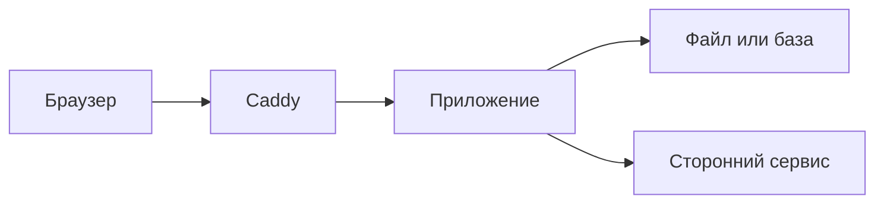

# Узкие места

## Ситуация

Сайт работает медленно. Напрашивается решение — взять сервер помощнее.

Но представьте, что настоящая причина — ограничение стороннего сервиса, который разрешает десять обращений в минуту. Тогда сервер за вдвое большие деньги не изменит ровным счётом ничего.

## Зачем это нужно

Узкое место — это ресурс, который заканчивается первым и заставляет всех остальных ждать. Растить нужно именно его, а не «сервер вообще».

Кандидатов немного, и у каждого свой характерный признак.

| Симптом | Что закончилось | Что делать первым |
|---|---|---|
| Свободной памяти почти нет, записи о нехватке | память | лимиты контейнеров, убрать лишнее, потом вертикаль |
| Диск занят больше 85% | место | чистка, а не смена тарифа |
| Главная быстрая, а генерация долгая | процессор или сторонний сервис | вынести долгое в очередь |
| Ответ «слишком много запросов» от нейросети | чужой лимит | очередь, кэш, другой тариф у поставщика |
| База медленная при простом сайте | диск или процессор базы | вынести базу, добавить индексы |
| Локально всё быстро, на сервере таймаут | сеть, DNS или вахтёр | читать логи по слоям |

### Две вещи, которые особенно легко упустить

**Конкуренция на одном ядре.** У вас одно ядро. Если одно тяжёлое дело занимает его целиком, открытие обычной страницы будет ждать своей очереди. Это выглядит как «сайт тормозит», хотя памяти полно.

**Чужие лимиты.** Ограничение стороннего сервиса не имеет отношения к вашему железу. Никакой тариф VPS его не сдвинет.

!!! note "Новые слова"
    - **Узкое место** — ресурс, заканчивающийся первым.
    - **Лимит API** — ограничение количества обращений, установленное чужим сервисом.
    - **Операции ввода-вывода** — обращения к диску. На дешёвом диске запись большого архива может подвесить сайт сильнее, чем загрузка процессора.

## Как это устроено

Цепочка типичного проекта:



Тормозить может любое звено, и лечение у каждого своё.

## Практика

### Шаг 1. Снять слепок в спокойное время

**Зачем:** без точки отсчёта вы не поймёте, что изменилось в плохой момент.

**Где вводить:** терминал сервера (`ssh ucheb`)

```bash
free -h
df -h /
docker stats --no-stream
uptime
```

**Что должно получиться:** четыре набора чисел.

- `free -h` — колонка `available`, обычно 400–600 МБ;
- `df -h /` — процент занятости диска;
- `docker stats` — расход памяти контейнером и его лимит;
- `uptime` — в конце три числа средней загрузки. На одном ядре значение около 1,0 означает, что процессор занят полностью.

Запишите их в инвентарь с датой.

### Шаг 2. Измерить время ответа

**Где вводить:** терминал сервера

```bash
for i in 1 2 3; do
  curl -s -o /dev/null -w "%{time_total}\n" https://pulse.ваш-домен.ru/health
done
```

**Что должно получиться:** три числа, примерно одинаковые. Это ваше нормальное время ответа.

### Шаг 3. Проверить, что ест диск

**Зачем:** на 10 ГБ место кончается незаметно.

**Где вводить:** терминал сервера

```bash
docker system df
sudo du -sh /var/log
sudo journalctl --disk-usage
```

**Что должно получиться:** три числа. Обычно больше всего занимают образы Docker — и это первое, что чистят.

### Шаг 4. Проверить чужие лимиты

**Где смотреть:** личный кабинет сервиса, которым пользуется ваш проект (нейросеть, отправка сообщений, почта).

Найдите раздел с ограничениями и выпишите:

- сколько обращений в минуту разрешено;
- сколько израсходовано за месяц;
- что происходит при превышении.

**Что должно получиться:** отдельная строка в инвентаре, не связанная с железом. Это колонка «чужие ограничения».

### Шаг 5. Сравнить в плохой момент

Когда сайт начнёт вести себя странно, повторите шаги 1 и 2 и сравните с записанным.

**Что должно получиться:** видно, какое именно число изменилось сильнее всего. Это и есть ваш подозреваемый.

## Проверка

- [ ] Слепок нормального состояния записан с датой.
- [ ] Вы знаете обычное время ответа своего сайта.
- [ ] Проверили, что занимает диск.
- [ ] Выписали чужие ограничения отдельно от железа.
- [ ] Не предлагаете кластер в ответ на «кончился диск».

## Частые ошибки

!!! failure "Запускать нагрузочный тест с самого сервера"
    Программа для теста съест ту же память, которую вы измеряете. Результат будет бессмысленным, а сервер может лечь.

!!! failure "Считать, что дело всегда в базе"
    У простой страницы базы нет вовсе. У бота чаще всего упирается в ограничения сторонних сервисов.

!!! failure "Менять тариф, не сняв показатели"
    Половина случаев «нужен сервер мощнее» лечится удалением старых образов Docker.

!!! failure "Не записывать нормальные значения"
    Число 180 МБ свободной памяти — это плохо или как обычно? Без записи ответа нет.

## Как это в больших командах

Используют инструменты, которые показывают, сколько времени запрос провёл в базе, сколько в вычислениях, сколько в ожидании сети. По сути, та же развилка, но ответ приходит автоматически.

Ваша таблица симптомов даёт тот же результат, просто вручную.

## Итог

Сначала измерить, что именно кончилось. Потом решать: усиливать машину, выносить долгую работу или договариваться с чужими лимитами.

Дальше — про очереди и кэш, два способа не держать человека в ожидании.

Далее: [Очереди и кэш](03-ocheredi-i-kesh.md).

!!! info "Нагрузка на учебный VPS"
    **Влезает в 1 ГБ.** Команды только читают показатели.
