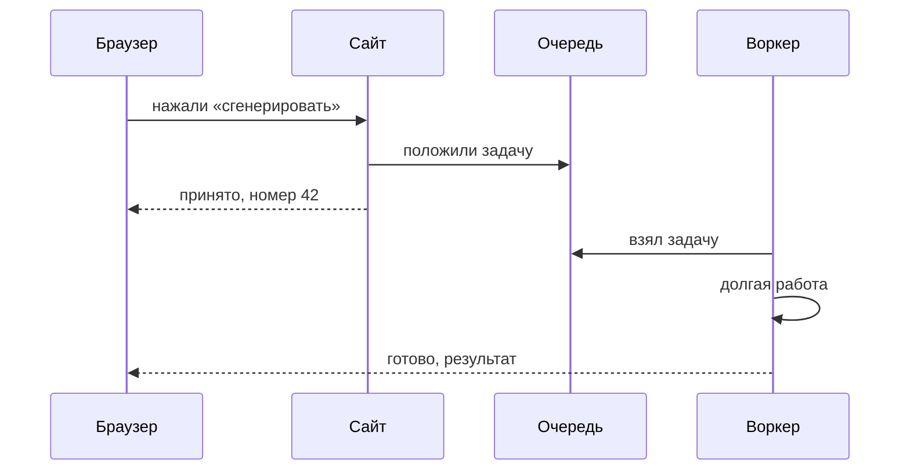

# Очереди и кэш

## Ситуация

Человек нажимает кнопку «сгенерировать». Нейросеть думает сорок секунд. Всё это время браузер ждёт, а страница висит.

Дальше предсказуемо: человек решает, что зависло, и нажимает ещё раз. Теперь генераций две, и счёт от поставщика тоже двойной. А если в этот момент зайдёт кто-то другой, он увидит медленный сайт — процессор занят.

## Зачем это нужно

Открыть страницу и сделать тяжёлую работу — разные жанры. Смешивать их в одном запросе — примерно как обслуживать кассу и печь торт в одном окне: очередь живых людей встанет.

Решений два, и они про разное.

**Очередь** решает задачу «принять сейчас, сделать потом». Приложение кладёт задачу в список и сразу отвечает человеку: «принято, номер такой-то». Отдельный процесс — его называют воркером — разбирает список и выполняет работу. Результат приходит позже: на страницу, в почту, в Telegram.

**Кэш** решает задачу «это уже считали». Если тот же самый запрос был пять минут назад, зачем звать нейросеть снова — отдайте сохранённый ответ.

### Когда что применять

| Ситуация | Лекарство |
|---|---|
| Работа короче пары секунд | ничего не нужно, оставьте как есть |
| Работа длится десятки секунд | очередь |
| Одинаковые запросы повторяются | кэш |
| Сайт медленный вообще на всём | не очередь, а вертикальный рост |

Последняя строка важна: очередь не лечит нехватку памяти. Это разные болезни.

!!! note "Новые слова"
    - **Синхронно** — браузер ждёт окончания работы.
    - **Воркер** — отдельный процесс, выполняющий задачи из очереди.
    - **TTL** — срок жизни записи в кэше: сколько секунд мы верим сохранённому ответу.
    - **Идемпотентность** — свойство, при котором повтор той же операции не создаёт вторую генерацию или второе списание денег.

## Как это устроено



Сравните с тем, что происходит без очереди: человек ждёт сорок секунд, вахтёр обрывает соединение по таймауту, человек жмёт повторно, и вы платите дважды.

!!! danger "Очередь должна жить вне процесса сайта"
    Если список задач хранится в памяти приложения, перезагрузка сервера уничтожит все незавершённые задачи. Очередь хранят в файле, в базе или в специальной программе.

!!! warning "На 1 ГБ очередь не ставят"
    Отдельная программа для очередей плюс воркер плюс сайт на одном гигабайте — это гарантированная нехватка памяти.

    Варианты для вас: вынести тяжёлую работу в n8n, который уже работает на другой машине, либо дождаться вертикального роста и сделать простую очередь в виде таблицы в базе с одним воркером.

## Практика

Учебному «Пульсу» очередь не нужна — он лёгкий. Этот урок про ваши будущие проекты, поэтому практика бумажная.

### Шаг 1. Найти долгие операции в своём проекте

Выпишите всё, что в вашем проекте занимает больше пары секунд:

- обращение к нейросети;
- формирование отчёта;
- обработка загруженного файла;
- рассылка сообщений.

**Что должно получиться:** список кандидатов на вынос в очередь.

### Шаг 2. Измерить, сколько это на самом деле

**Зачем:** «долго» — не число. Решение принимают по секундам.

**Где вводить:** PowerShell на вашем компьютере

```powershell
Measure-Command { Invoke-WebRequest -Uri "https://ваш-сервис/долгая-операция" -UseBasicParsing }
```

**Что должно получиться:** поле `TotalSeconds` в выводе. Ориентир простой:

- меньше 2 секунд — оставьте синхронно;
- 2–10 секунд — стоит подумать;
- больше 10 секунд — переносите в очередь.

### Шаг 3. Проверить таймаут вахтёра

**Зачем:** если работа длится дольше, чем вахтёр готов ждать, человек получит ошибку даже при исправном приложении.

**Где смотреть:** файл `Caddyfile` на сервере. По умолчанию Caddy ждёт довольно долго, но это стоит знать.

**Что должно получиться:** понимание, что увеличение таймаута — это не решение, а отсрочка. Правильное решение — очередь.

### Шаг 4. Выбрать кандидатов на кэш

Ответьте на вопрос: какие запросы в вашем проекте повторяются дословно?

**Что должно получиться:** список. Типичные кандидаты — справочники, списки товаров, результаты для одинакового текста запроса.

!!! danger "Персональные ответы кэшируют осторожно"
    Если в ключе кэша нет идентификатора пользователя, один человек увидит ответ, предназначенный другому. Это утечка, а не оптимизация.

### Шаг 5. Записать план

Занесите в инвентарь три строки:

1. Первая операция, которую унесу в очередь.
2. Что будет кэшироваться и на сколько секунд.
3. Признак, по которому пойму, что пора: таймауты, двойные нажатия, счёт от поставщика.

## Проверка

- [ ] Вы отличаете «сайт вообще медленный» от «одна операция долгая».
- [ ] Измерили длительность своих операций в секундах.
- [ ] Знаете, почему очередь нельзя держать в памяти процесса.
- [ ] Выбрали кандидатов на кэш и учли персональные данные.

## Частые ошибки

!!! failure "Хранить очередь в памяти приложения"
    Перезагрузка — и задачи исчезли. Человек ждёт результат, которого уже не будет.

!!! failure "Поставить очередь, кэш и воркер сразу на 1 ГБ"
    Вернётесь к нехватке памяти. Сначала вынесите тяжёлое туда, где есть ресурсы.

!!! failure "Кэш без срока жизни"
    Человек видит вчерашние данные и думает, что сайт сломался. Срок задают всегда.

!!! failure "Не думать про повторы"
    Сообщение от платёжной системы может прийти дважды. Если повтор создаёт второе списание — это уже не техническая, а денежная проблема. Подробнее в модуле 15.

## Как это в больших командах

Существуют отдельные программы для очередей, несколько воркеров, ограничения по времени выполнения и специальная очередь для задач, которые падают снова и снова.

Смысл при этом ровно тот же, что у папки с файлами задач и одного скрипта, который их разбирает.

## Итог

Быстрое — в обычный запрос, долгое — в очередь, повторяющееся — в кэш. Железо усиливают, когда это не помогло.

Дальше — практическая лестница роста для российских условий.

Далее: [Что делать в РФ](04-masshtab-v-rf.md).

!!! info "Нагрузка на учебный VPS"
    **Только теория.** Очередь на 1 ГБ в лаборатории не ставим.
