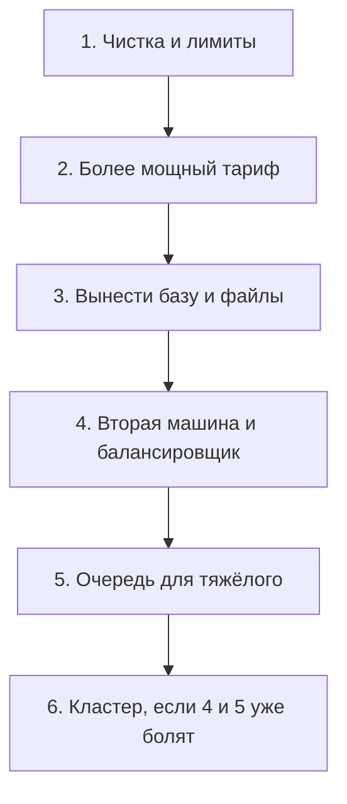

# Что делать в РФ, когда одного VPS мало

## Ситуация

Англоязычные руководства по росту обычно начинаются с фразы «возьмите управляемый кластер в AWS». Для проекта, который оплачивается российской картой и живёт у российского хостера, это плохо применимо.

Нужна другая лестница — та, что начинается с панели вашего хостера.

## Зачем это нужно

Шесть ступеней по возрастанию сложности. Важно идти по порядку и не перепрыгивать.

**1. Почистить и ограничить.** Удалить старые образы, выставить лимиты памяти, убрать то, что не нужно. Эта ступень бесплатна и часто закрывает вопрос целиком.

**2. Усилить машину.** Перейти на тариф с 2–4 ГБ. Кнопка в панели, несколько минут простоя.

**3. Вынести данные.** Если появилась настоящая база — она не должна жить на том же диске, что логи Docker. Хостеры предлагают базу как услугу: вы получаете адрес и пароль, а дисками и копиями занимаются они.

**4. Вторая машина плюс балансировщик.** Два одинаковых приложения, общие данные, домен указывает на балансировщик.

**5. Вынести тяжёлую работу в очередь.** Отдельный процесс на отдельной машине.

**6. Кластер.** Только если четвёртая и пятая ступени стали болезненными из-за количества машин.

| Ступень | Стоимость | Сложность |
|---|---|---|
| Чистка и лимиты | бесплатно | низкая |
| Более мощный тариф | + несколько сотен рублей | низкая |
| База как услуга | заметно дороже своей | средняя |
| Вторая машина | двойная цена плюс балансировщик | средняя |
| Очередь | ещё одна машина | средняя |
| Кластер | высокая | высокая |

!!! warning "Кластер не лечит один гигабайт"
    Kubernetes имеет смысл, когда машин и выкладок много и управлять ими руками стало тяжело. Это не апгрейд для сервера, у которого кончилась память.

!!! note "Новые слова"
    - **База как услуга (managed)** — база данных, которую обслуживает хостер: диски, копии, обновления.
    - **Балансировщик хостера** — их сервис принимает запросы и распределяет по вашим машинам. Сертификат часто живёт на нём, а не у вас.
    - **Объектное хранилище** — общий шкаф для файлов, чтобы несколько серверов видели одни и те же данные.

## Как это устроено



Из российских провайдеров ступени 3 и 4 делаются кнопками в Yandex Cloud, VK Cloud и Selectel. Обычные VPS-хостеры обычно предлагают только вертикальный рост.

## Практика

### Шаг 1. Пройти первую ступень прямо сейчас

**Зачем:** она бесплатна и часто даёт больше, чем смена тарифа.

**Где вводить:** терминал сервера (`ssh ucheb`)

```bash
docker system df
```

**Что должно получиться:** таблица. Обратите внимание на колонку `RECLAIMABLE` — это то, что можно освободить.

Смотрим, что именно удалится, **до** удаления:

```bash
docker image ls -a
docker ps -a
```

**Что должно получиться:** список образов и контейнеров. Убедитесь, что понимаете, какие из них старые.

Теперь чистим только заведомо ненужное:

```bash
docker image prune
```

Эта команда удаляет образы без имени, оставшиеся от пересборок. Она безопаснее, чем полная очистка.

**Что должно получиться:** строка `Total reclaimed space` с освобождённым объёмом.

!!! danger "Полную очистку с удалением томов не выполняйте"
    Команда очистки с флагами, затрагивающими тома, унесёт данные и сертификаты. На этом сервере она вам не нужна никогда.

### Шаг 2. Проверить лимиты памяти

**Где вводить:** терминал сервера

```bash
docker stats --no-stream
```

**Что должно получиться:** у каждого контейнера в колонке лимита стоит конкретное число, а не весь объём памяти сервера. Если лимита нет — добавьте его в файл запуска.

### Шаг 3. Оценить эффект

**Где вводить:** терминал сервера

```bash
df -h /
free -h
```

**Что должно получиться:** сравните с записями из прошлого урока. Возможно, первая ступень уже сняла вопрос о росте.

### Шаг 4. Написать план на полстраницы

**Зачем:** решение о росте принимают заранее и на трезвую голову, а не в день, когда всё легло.

Ответьте на четыре вопроса и запишите в инвентарь:

1. Какой тариф следующий и сколько стоит?
2. Куда уедут данные, когда их станет много?
3. Понадобится ли второй адрес и балансировщик?
4. Что останется на самом сервере? (В идеале только приложение и вахтёр.)

**Что должно получиться:** план на полстраницы. Покупать ничего не нужно — план на то и план.

### Шаг 5. Проверить план на отсутствие перепрыгиваний

Перечитайте написанное. В нём не должно быть пункта про кластер, пока нет пунктов про более мощный тариф и общие данные.

## Проверка

- [ ] Первая ступень пройдена, место освобождено.
- [ ] У всех контейнеров есть лимиты памяти.
- [ ] План роста записан и отвечает на четыре вопроса.
- [ ] В плане нет перепрыгивания через ступени.

## Частые ошибки

!!! failure "Открыть базу данных в интернет"
    База, доступная снаружи, находят автоматические сканеры за часы. Доступ разрешают только с адреса вашего приложения.

!!! failure "Поставить две машины с отдельными сертификатами на одно имя"
    Домен указывает куда-то одно, сертификаты выпускаются вразнобой. Сначала продумывается вход, потом добавляются машины.

!!! failure "Сразу идти на шестую ступень"
    Вы получите сложность, которой не умеете управлять, и не решите исходную проблему.

!!! failure "Пропустить чистку и сразу платить за тариф"
    Часто оказывается, что половину диска занимали образы от старых сборок.

## Как это в больших командах

Лестница та же, но шестая ступень наступает раньше — из-за количества команд и сервисов, а не из-за нагрузки на одну машину.

Физика при этом не меняется: данные должны быть общими, вход — единым, тяжёлое — асинхронным.

## Итог

Российский путь: почистить, усилить, вынести данные, добавить машину. Кластер — отдельная тема модуля 18, а не следующий шаг после одного гигабайта.

Далее: [Лаборатория. Осторожный мини-тест](../../labs/lab-13-mini-nagruzka.md).

!!! info "Нагрузка на учебный VPS"
    **Чистка образов освобождает место.** Покупки не требуются.
