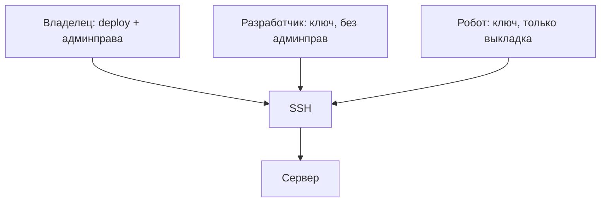

# Ключи и роли

## Ситуация

Нужно, чтобы подрядчик посмотрел проблему на сервере. Самый быстрый способ — прислать ему пароль администратора в мессенджере.

Проблема даже не в том, что пароль в переписке. Проблема в том, что такой доступ выданный «на час» живёт годами. А когда что-то сломается, вы не сможете ответить, кто заходил на сервер — потому что все заходили под одной учётной записью.

## Зачем это нужно

Правильный доступ строится на двух вещах.

**Именной ключ** отвечает на вопрос «кто именно зашёл». Пара ключей принадлежит конкретному человеку или конкретному роботу. Ушёл человек — удалили одну строку, все остальные продолжают работать.

**Роль** отвечает на вопрос «что этому человеку можно». Не «всё или ничего», а ровно столько, сколько нужно для работы.

### Роли в маленьком проекте

| Роль | Что может | Кто это |
|---|---|---|
| Владелец | всё, включая административные права | вы |
| Разработчик | писать в папку приложения | подрядчик на задаче |
| Наблюдатель | только читать логи | тот, кто помогает разобраться |
| Робот | обновить код и перезапустить | автоматическая выкладка |

!!! danger "Группа docker — это почти права администратора"
    Человек, добавленный в группу `docker`, может подключить к контейнеру любую папку сервера и получить полный доступ. «Только посмотреть логи» через эту группу не выдаётся.

    Правильнее дать разрешение на одну конкретную команду или просто прислать логи самой.

!!! warning "Не путайте два разных доступа"
    Доступ к серверу и учётная запись клиента на вашем сайте — совершенно разные вещи. Смешать их означает выдать клиенту вход на сервер. Про клиентов будет модуль 15.

!!! note "Новые слова"
    - **Именной ключ** — пара ключей, принадлежащая одному человеку или роботу.
    - **Роль** — набор разрешений.
    - **sudoers** — файл, где перечислено, какие команды пользователю разрешено выполнять с правами администратора.
    - **Отзыв** — процедура снятия доступа.

## Как это устроено



Если все заходят под одной учётной записью, эта схема превращается в одну стрелку — и вопрос «кто это сделал» остаётся без ответа навсегда.

## Практика

### Шаг 1. Посмотреть, кто сейчас имеет доступ

**Где вводить:** терминал сервера (`ssh ucheb`)

```bash
wc -l ~/.ssh/authorized_keys
cat ~/.ssh/authorized_keys | awk '{print $NF}'
```

Вторая команда печатает только комментарии в конце строк — обычно там написано, чей это ключ.

**Что должно получиться:** список подписей. Например, `student@notebook` и `github-actions-pulse`.

Если вы видите строку, происхождение которой не помните, — это повод разобраться немедленно.

### Шаг 2. Проверить, кто имеет административные права

**Где вводить:** терминал сервера

```bash
getent group sudo
getent group docker
```

**Что должно получиться:** в обеих строках после двоеточия перечислены пользователи. Там должен быть только `deploy`.

Помните: список группы `docker` по последствиям равен списку администраторов.

### Шаг 3. Посмотреть, кто заходил

**Где вводить:** терминал сервера

```bash
last -n 20
```

**Что должно получиться:** таблица последних входов с именами пользователей, адресами и временем.

Проверьте адреса: все ли они ваши? Незнакомый адрес в списке успешных входов означает, что пора менять ключи.

### Шаг 4. Завести таблицу доступов

Создайте в инвентаре таблицу и заполните:

| Имя | Роль | Где ключ | Админправа | До какой даты |
|---|---|---|---|---|
| deploy | владелец | мой компьютер | да | бессрочно |
| ci | робот | секреты GitHub | нет | пока работает выкладка |

Строка на каждый ключ из шага 1. Если строк в таблице меньше, чем ключей на сервере, — у вас есть доступ, о котором вы забыли.

### Шаг 5. Запомнить порядок добавления человека

Полностью отработаете в лаборатории, сейчас — порядок:

```bash
sudo adduser dev
sudo mkdir -p /home/dev/.ssh
sudo nano /home/dev/.ssh/authorized_keys
sudo chown -R dev:dev /home/dev/.ssh
sudo chmod 700 /home/dev/.ssh
sudo chmod 600 /home/dev/.ssh/authorized_keys
```

Ключевой момент: в файл вставляется **публичный** ключ человека. Свой приватный ключ вы не передаёте никому и никогда.

## Проверка

- [ ] Вы знаете, сколько ключей имеет доступ к серверу и чьи они.
- [ ] Административные права только у вашей учётной записи.
- [ ] Группа `docker` не раздана посторонним.
- [ ] Таблица доступов заполнена и совпадает с реальностью.
- [ ] Вы просмотрели последние входы и не нашли незнакомых.

## Частые ошибки

!!! failure "Один ключ на всех"
    Отзыв доступа у одного человека потребует перевыпуска ключей для всех остальных. И вы никогда не узнаете, кто именно что сделал.

!!! failure "Добавить подрядчика в группу docker «на день»"
    День превращается в год. Если всё-таки добавили — сразу поставьте напоминание на дату снятия.

!!! failure "Передать свой приватный ключ"
    Приватный ключ не передаётся никому ни при каких обстоятельствах. Человек создаёт свой и присылает вам публичную часть.

!!! failure "Не вести таблицу, пока работаете одна"
    Именно сейчас её завести проще всего — строк мало. Потом вспоминать будет нечего.

## Как это в больших командах

Доступы выдаются через единую систему входа, ключи выпускаются на несколько часов и автоматически перестают работать. Отзыв делается одной галочкой, и она снимает доступ сразу везде.

Вы воспроизводите ту же логику файлами и таблицей в инвентаре.

## Итог

Именной ключ плюс минимально необходимая роль. Общего доступа с полными правами не существует.

Дальше — как не выставлять в интернет административные панели.

Далее: [Админки и туннель](02-adminki-i-tunnel.md).

!!! info "Нагрузка на учебный VPS"
    **Влезает в 1 ГБ.** Дополнительный пользователь почти ничего не занимает.
