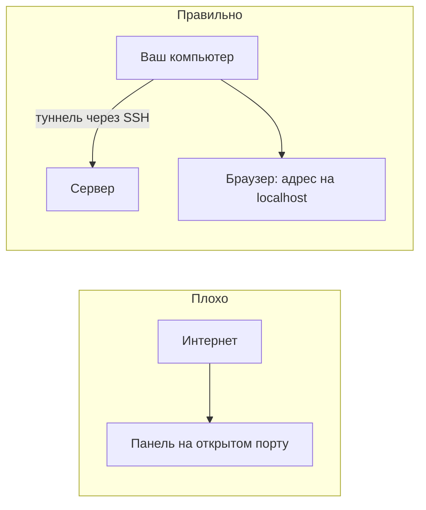

# Админки, туннель, аудит

## Ситуация

Вы поставили панель управления — удобно нажимать кнопки вместо команд. Чтобы открывать её из дома, опубликовали порт наружу.

Через несколько часов в журналах появятся попытки входа с адресов, которых вы не знаете. Автоматические сканеры обходят интернет постоянно и находят такие панели быстрее, чем вы успеваете о них забыть.

## Зачем это нужно

Различайте две вещи:

- **ваш продукт** — то, ради чего люди приходят. Живёт на 443, доступен всем.
- **административная панель** — то, чем управляете вы. С улицы её быть не должно вообще.

Пароль на панели не решает проблему полностью: пароли подбирают, а в самих панелях находят уязвимости. Безопаснее сделать так, чтобы снаружи её не было видно.

### Три способа добраться до закрытой панели

| Способ | Как работает | Сложность |
|---|---|---|
| **Туннель SSH** | браузер открывает адрес на вашем компьютере, а попадает на закрытый порт сервера | простой, рекомендуется |
| **Пароль на вахтёре** | панель за Caddy с проверкой пароля | средний, дверь всё же видна |
| **VPN** | частная сеть до сервера | сложный, на 1 ГБ спорный по памяти |

Туннель выигрывает по одной причине: порт панели вообще не открыт в файрволе. Сканер не найдёт того, чего нет.

!!! tip "Самый простой вариант — не ставить панель"
    На учебном тарифе команды `docker compose` и чтение логов закрывают те же потребности. Нет панели — нет ни дыры, ни расхода памяти.

!!! note "Новые слова"
    - **Админка** — веб-панель управления инфраструктурой, не кабинет клиента.
    - **Туннель SSH** — «труба», через которую локальный порт вашего компьютера соединяется с портом сервера.
    - **Аудит** — просмотр следов входа: кто, когда и откуда заходил.

## Как это устроено



Панель слушает только внутренний адрес сервера. Снаружи этот порт не открыт. Труба существует, пока открыто соединение SSH.

## Практика

### Шаг 1. Проверить, что лишнего не открыто

**Где вводить:** терминал сервера (`ssh ucheb`)

```bash
sudo ufw status
sudo ss -tulpn | grep '0.0.0.0'
```

**Что должно получиться:**

- в файрволе только 22, 80 и 443;
- в списке слушающих на всех адресах — только эти же порты.

Если видите открытыми порты вроде 3000, 5432, 5678, 9090 — это те самые «удобные» двери, которые надо закрыть.

### Шаг 2. Запомнить команду туннеля

**Зачем:** пригодится, как только появится любая панель.

**Где вводить:** PowerShell на вашем компьютере

```powershell
ssh -L 3000:127.0.0.1:3000 ucheb
```

Читается так: «порт 3000 на моём компьютере соединить с портом 3000 на сервере, доступным только изнутри».

**Что должно получиться:** обычная сессия SSH. Пока она открыта, адрес `http://127.0.0.1:3000` в вашем браузере ведёт на сервер.

Если панели пока нет, браузер покажет ошибку подключения — это нормально, туннель есть, а слушать на том конце некому.

### Шаг 3. Проверить туннель на чём-нибудь существующем

**Зачем:** убедиться, что механизм работает, на примере «Пульса».

**Где вводить:** PowerShell на вашем компьютере

```powershell
ssh -L 9999:127.0.0.1:8080 ucheb
```

Оставьте окно открытым и в браузере откройте `http://127.0.0.1:9999/health`.

**Что должно получиться:** ответ `{"status":"ok"}`. Вы обратились к порту 8080 сервера, который снаружи закрыт.

Закройте сессию SSH и обновите страницу.

**Что должно получиться:** ошибка подключения. Труба закрылась вместе с сессией — именно так это и должно работать.

### Шаг 4. Посмотреть следы входов

**Зачем:** регулярный просмотр занимает минуту и иногда показывает неприятные сюрпризы.

**Где вводить:** терминал сервера

```bash
last -n 20
sudo journalctl -u ssh --since "7 days ago" --no-pager | grep Accepted | tail -20
```

**Что должно получиться:** список успешных входов с адресами и временем.

На что смотреть:

- все ли адреса ваши;
- нет ли входов в странное время;
- нет ли учётных записей, которых вы не заводили.

Незнакомый успешный вход означает: меняйте ключи и проходите процедуру из следующего урока.

### Шаг 5. Включить двухфакторную защиту в панели хостера

**Зачем:** панель хостера — это полный доступ к машине, включая возможность её удалить. Это самый ценный замок во всей схеме.

**Где делать:** личный кабинет хостера, раздел безопасности.

**Что должно получиться:** при входе запрашивается код из приложения. Резервные коды сохраните в менеджере паролей.

## Проверка

- [ ] В файрволе только 22, 80 и 443.
- [ ] Вы умеете открывать туннель и проверили его на практике.
- [ ] Видели, как туннель закрывается вместе с сессией.
- [ ] Просмотрели входы за неделю.
- [ ] В панели хостера включена двухфакторная защита.

## Частые ошибки

!!! failure "Открыть панель в интернет «всего на час»"
    Сканеры работают быстрее. Час — это очень много времени.

!!! failure "Настроить туннель и одновременно открыть порт в файрволе"
    Тогда туннель бессмысленен: дверь всё равно видна снаружи.

!!! failure "Считать пароль достаточной защитой панели"
    Пароль защищает от случайного прохожего, но не от уязвимости в самой панели.

!!! failure "Оставить панель хостера без второго фактора"
    Это самый ценный доступ из всех. Пароль от него подобрать или украсть проще, чем ключ SSH.

## Как это в больших командах

Есть корпоративная частная сеть или специальная машина-посредник, через которую проходят все подключения. Панели защищены единой системой входа.

Идея одна и та же: административные интерфейсы не выставляют на всеобщее обозрение.

## Итог

Панели живут за туннелем, порты наружу — только 22, 80 и 443, входы просматриваются раз в месяц.

Дальше — что делать, когда человек перестал работать с проектом.

Далее: [Уход человека](03-uhod-cheloveka.md).

!!! info "Нагрузка на учебный VPS"
    **Влезает в 1 ГБ.** Туннель не создаёт нагрузки.
