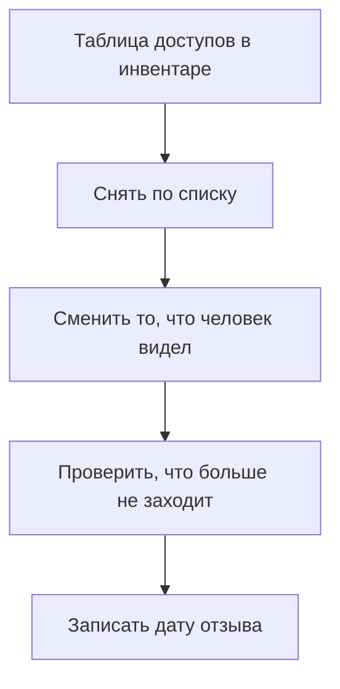

# Чеклист ухода человека

## Ситуация

Подрядчик закончил работу. Вы поблагодарили друг друга, и на этом всё.

А доступ остался. Ключ на сервере, участие в репозитории, возможно, токен бота, который он видел в переписке. Через полгода вы уже не вспомните, что нужно было снять.

## Зачем это нужно

Отзыв доступа — это процедура, а не вежливость и не реакция на ссору. Пятнадцать минут по готовому списку стоят дешевле, чем ночной разбор непонятного происшествия.

Главная сложность в том, что доступ — это не только SSH. Замков обычно больше, чем помнится.

### Полный список замков

| # | Что снять | Где |
|---|---|---|
| 1 | Ключ SSH | `authorized_keys` на всех машинах |
| 2 | Доступ в панель хостера | кабинет хостера, пользователи и токены |
| 3 | Доступ к домену | кабинет регистратора |
| 4 | Участие в репозитории | GitHub: соавторы, ключи выкладки, секреты |
| 5 | Токен бота | BotFather, если токен мог быть виден |
| 6 | Платёжный кабинет | ЮKassa и подобные, из модуля 15 |
| 7 | Почта для восстановления паролей | почтовый ящик проекта |
| 8 | Рабочие чаты и документация | группы с административными правами |

Пункты 5 и 6 — это не снятие доступа, а смена секретов. Если человек видел токен, удаление его из чата ничего не меняет: токен надо выпускать заново.

!!! tip "Список пишется заранее"
    Лучший момент составить этот список — сегодня, когда всё спокойно. В момент конфликта или спешки вы что-нибудь забудете.

!!! note "Новые слова"
    - **Офбординг** — процедура снятия всех доступов.
    - **Поверхность доступа** — полный перечень мест, куда человек мог заходить.

## Как это устроено



Последний шаг обязателен. Без проверки вы не знаете, сработал отзыв или нет.

## Практика

### Шаг 1. Примерить список на себя

**Зачем:** самый честный способ найти дыры — представить, что украли ваш ноутбук.

Пройдите по восьми пунктам и ответьте: что вы сможете отозвать за пятнадцать минут?

**Что должно получиться:** список слабых мест. Чаще всего это панель хостера без второго фактора и почта, через которую восстанавливаются все остальные пароли.

### Шаг 2. Проверить, кто есть на сервере

**Где вводить:** терминал сервера (`ssh ucheb`)

```bash
cut -d: -f1,3 /etc/passwd | awk -F: '$2 >= 1000 {print $1}'
```

Команда показывает обычных пользователей, не системных.

**Что должно получиться:** список имён. Там должен быть только `deploy` и, возможно, учебный пользователь из лаборатории.

### Шаг 3. Проверить ключи у каждого

**Где вводить:** терминал сервера

```bash
sudo find /home -name authorized_keys -exec sh -c 'echo "--- {}"; awk "{print \$NF}" {}' \;
```

**Что должно получиться:** для каждого пользователя список подписей его ключей.

Сравните с таблицей доступов из первого урока. Расхождение означает забытый доступ.

### Шаг 4. Отработать отзыв ключа

**Зачем:** запомнить две команды до того, как они понадобятся.

Снять один ключ, оставив пользователя:

```bash
sudo nano /home/ИМЯ/.ssh/authorized_keys
```

Удалить строку с нужным ключом и сохранить.

Удалить пользователя целиком:

```bash
sudo deluser --remove-home ИМЯ
```

**Что должно получиться:** понимание разницы. Первое — временное ограничение, второе — окончательное удаление вместе с домашней папкой.

### Шаг 5. Проверить, что отзыв сработал

**Зачем:** это тот самый шаг, который пропускают.

**Где вводить:** PowerShell на вашем компьютере, пробуя зайти отозванным ключом

```powershell
ssh -i $env:USERPROFILE\.ssh\id_ed25519_ОТОЗВАННЫЙ deploy@203.0.113.10
```

**Что должно получиться:** `Permission denied (publickey)`. Отказ здесь — правильный результат.

### Шаг 6. Записать чеклист в инвентарь

Скопируйте таблицу из восьми пунктов в инвентарь как готовую процедуру. Добавьте колонку «дата отзыва».

**Что должно получиться:** список, который в нужный момент останется просто пройти сверху вниз.

## Проверка

- [ ] Вы знаете все восемь групп замков.
- [ ] Проверили, какие пользователи и ключи есть на сервере.
- [ ] Список совпадает с таблицей доступов.
- [ ] Знаете разницу между снятием ключа и удалением пользователя.
- [ ] Умеете проверить, что отзыв сработал.
- [ ] Чеклист записан в инвентарь.

## Частые ошибки

!!! failure "Удалить пользователя на одной машине и забыть про остальные"
    Ключ может лежать ещё где-то — в другом сервере, в системе выкладки. Для этого и нужна таблица.

!!! failure "Сменить пароль от панели, оставив ключ SSH"
    Это два независимых замка. Смена одного не влияет на другой.

!!! failure "Не сменить секреты, которые человек видел"
    Удаление из чата не отзывает токен. Отзывает только выпуск нового.

!!! failure "Не проверить результат отзыва"
    Вы будете считать доступ закрытым, а он останется открытым.

## Как это в больших командах

Создаётся заявка на отзыв, и автоматическая система снимает все роли сразу по всем системам. Для этого доступы изначально выдаются централизованно.

Ваша автоматика — это чеклист из восьми пунктов. Работает он не хуже, если им пользуются.

## Итог

Список замков написан заранее, отзыв — процедура с проверкой результата, дата записана.

Далее: [Лаборатория. Второй пользователь](../../labs/lab-14-vtoroy-polzovatel.md).

!!! info "Нагрузка на учебный VPS"
    **Влезает в 1 ГБ.**
