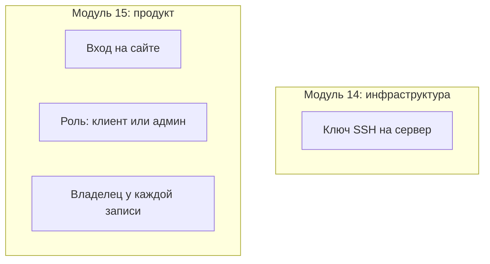

# Пользователи, роли, арендаторы

## Ситуация

До этого момента слово «доступ» означало вход на сервер. Теперь появляется второе значение: учётная запись клиента на вашем сайте.

Эти две вещи легко перепутать в голове, и путаница выходит дорого. В одну сторону — вы выдаёте клиенту то, чем он управлять не должен. В другую — один клиент видит данные другого.

## Зачем это нужно

Речь в этом уроке идёт про **продукт**, а не про сервер. Четыре понятия, которые надо различать.

**Аутентификация** отвечает на вопрос «кто ты»: пароль, ссылка на почту, вход через стороннюю службу.

**Авторизация** отвечает на вопрос «что тебе можно». Это не то же самое: «я вошла» ещё не значит «мне всё разрешено».

**Сессия** — состояние «уже вошёл», действующее какое-то время. Хранится в браузере, подписывается секретом. Этот секрет живёт в `.env`: зная его, можно подделать чужой вход.

**Арендатор** — граница данных. Это может быть один человек или целая организация — как решите. Главное, чтобы данные одного не пересекались с данными другого.

### Главное правило

> Каждая строка данных знает своего хозяина, и проверка происходит на сервере.

Самая частая дыра в самодельных кабинетах выглядит так: список на главной странице отфильтрован правильно, а адрес вида `/notes/17` отдаёт чужую запись, потому что проверку там забыли.

Скрытая кнопка в интерфейсе — не защита. Защита — это проверка на сервере при каждом обращении.

### Роли в продукте

| Роль | Что видит | Чем это НЕ является |
|---|---|---|
| Клиент | только свои данные | — |
| Администратор продукта | список подписок, статусы | не доступ к серверу |
| Поддержка | чужие данные по обращению, с записью в журнал | не постоянный доступ ко всему |

!!! danger "Разные пароли для разных систем"
    Пароль администратора вашего продукта не должен совпадать с паролем от панели хостера. Это разные системы с разной ценой взлома.

!!! note "Новые слова"
    - **Мультитенантность** — несколько клиентов в одном приложении с непересекающимися данными.
    - **owner_id** — поле, указывающее, кому принадлежит запись.

## Как это устроено

У «Пульса» входа нет вовсе, и для учебной задачи это честно. Правила понадобятся, когда вы подставите сюда свой настоящий проект.

## Практика

Этот урок бумажный — он про устройство вашего будущего продукта.

### Шаг 1. Определить, что такое арендатор

Ответьте на один вопрос: граница данных проходит по человеку или по организации?

| Вариант | Когда подходит |
|---|---|
| Один человек | личные заметки, персональный инструмент |
| Организация | несколько сотрудников работают с общими данными |

**Что должно получиться:** один выбранный вариант. Менять его потом дорого, поэтому решайте осознанно.

### Шаг 2. Перечислить сущности с хозяином

Выпишите всё, что хранит ваш проект, и отметьте, у чего должен быть владелец.

Пример:

| Сущность | Нужен владелец |
|---|---|
| Заметка | да |
| Загруженный файл | да |
| История запросов | да |
| Справочник тарифов | нет, он общий |

**Что должно получиться:** список, в котором почти у всего стоит «да».

### Шаг 3. Проверить свой проект на утечку

**Зачем:** это конкретная проверка, которую стоит проделать до того, как придут люди.

Если у вас уже есть проект с входом:

1. Заведите две учётные записи — А и Б.
2. Войдите под А, создайте запись, запомните её адрес.
3. Войдите под Б и откройте тот же адрес.

**Что должно получиться:** ответ «не найдено» или «нет доступа». Если открылась чужая запись — у вас утечка данных.

Отдельно проверьте все адреса выгрузки и экспорта: там проверку забывают чаще всего.

### Шаг 4. Разделить роли

Запишите три строки:

1. Кто администратор продукта и что он может.
2. Чем он **не** является — доступом к серверу.
3. Где хранится его пароль.

## Проверка

- [ ] Вы не путаете доступ к серверу и учётную запись клиента.
- [ ] Определили, что считать арендатором.
- [ ] Знаете, у каких сущностей должен быть владелец.
- [ ] Проверили свой проект двумя учётными записями.
- [ ] Пароли администратора продукта и панели хостера разные.

## Частые ошибки

!!! failure "Фильтровать данные только на главной странице"
    Адреса отдельных записей и выгрузки остаются открытыми. Проверка нужна на каждом обращении.

!!! failure "Один общий аккаунт на всех клиентов"
    Это не экономия, а гарантированная утечка при первом же росте.

!!! failure "Прятать кнопку вместо проверки на сервере"
    Скрытая кнопка защищает только от тех, кто не умеет открывать адрес напрямую.

!!! failure "Давать поддержке постоянный доступ ко всем данным"
    Доступ выдают по обращению и записывают, кто и что смотрел.

## Как это в больших командах

Существуют отдельные системы управления учётными записями, а база данных умеет сама ограничивать выдачу строк по владельцу. Регулярно проводят проверки на попытку добраться до чужих данных.

Правило «у каждой строки есть владелец, проверка на сервере» вы соблюдаете с первого дня — это большая часть пути.

## Итог

Вход на сайт и доступ к серверу — разные вселенные. Данные разделяются по владельцу, и проверяется это на сервере.

Дальше — про деньги.

Далее: [Тарифы и ЮKassa](02-tarify-i-yookassa.md).

!!! info "Нагрузка на учебный VPS"
    **Только теория.**
