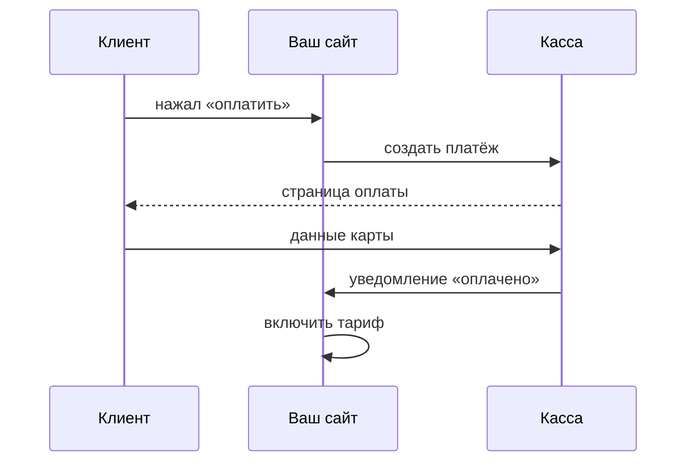

# Тарифы и ЮKassa

## Ситуация

В зарубежных руководствах приём платежей описывают через Stripe. Для проекта с российскими клиентами и картами это чаще всего неприменимо.

При этом сам принцип приёма денег от выбора сервиса не зависит. Разберём его на примере ЮKassa — это рабочий ориентир, а не реклама. У Т-Банка и CloudPayments устроено похоже.

## Зачем это нужно

Главное, что надо понять: **вы не принимаете карты**. Это делает лицензированный сервис.

### Что берёт на себя касса

- принимает данные карты на своей странице;
- соблюдает банковские требования;
- проводит платёж через банк;
- сообщает вам результат;
- часто формирует кассовый чек.

Номер карты у вас не хранится и через ваш сервер не проходит. В этом и смысл: опасная часть отдана тому, у кого есть лицензия и проверки.

### Чего касса не делает

| Задача | Чья |
|---|---|
| Придумать тарифы | ваша |
| Помнить, кто до какого числа оплатил | **ваша** |
| Решать, пускать ли в функцию | ваша |
| Принять карту | кассы |
| Провести деньги | кассы |

Вторая строка — самая важная. Статус подписки живёт в **вашей** таблице. Кабинет кассы — это про платежи, а не база ваших клиентов.

### Статусы подписки

Хранить у себя стоит примерно такой набор:

| Статус | Что означает |
|---|---|
| `none` | зарегистрировался, ничего не активировал |
| `trial` | идёт пробный период |
| `active` | оплачено, доступ есть |
| `past_due` | срок вышел, ждём оплату |
| `expired` | доступ выключен |
| `cancelled` | отказался продлевать |

!!! danger "Боевые ключи только в рабочем окружении"
    У кассы есть тестовый контур — он для репетиции. Боевой ключ в тестовом окружении означает либо списание настоящих денег, либо непонимание, что именно сломано.

    Ключи магазина — это секреты. Только `.env`, никогда не в репозиторий.

!!! note "Новые слова"
    - **Провайдер оплаты** — сервис, принимающий карты за вас.
    - **Пробный период** — доступ без оплаты в течение нескольких дней.
    - **Чек по 54-ФЗ** — фискальный документ, обязательный в России. Касса обычно умеет его формировать по договору. Это вопрос бухгалтерии, а не настройки сервера.

## Как это устроено



Обратите внимание на последние две стрелки. Тариф включается по **уведомлению от кассы**, а не по тому, что человек вернулся на страницу «спасибо». Об этом подробно в следующем уроке.

Пробный период устроен просто: записываете дату окончания, раз в день проверяете, не прошла ли она, и если оплаты нет — меняете статус.

## Практика

Подключать кассу для курса не нужно. Практика бумажная и подготовительная.

### Шаг 1. Описать свои тарифы

Выпишите каждый тариф одной строкой: название, цена, период, что входит.

| Тариф | Цена | Период | Что входит |
|---|---|---|---|
| Пробный | 0 | 7 дней | всё, кроме выгрузки |
| Базовый | | месяц | |

**Что должно получиться:** таблица на два-три тарифа. Больше на старте не нужно — сложные тарифные сетки трудно поддерживать.

### Шаг 2. Прочитать документацию кассы

**Где смотреть:** справка ЮKassa, разделы про создание платежа и про уведомления.

Найдите два слова: **«уведомления»** и **«идемпотентность»**.

**Что должно получиться:** вы понимаете, что касса умеет присылать уведомления и что она предусматривает повторную отправку. Второе объясняет, зачем нужен следующий урок.

!!! warning "Магазин не создавайте заранее"
    Регистрация магазина — это договор с обязательствами. Делайте этот шаг, когда действительно готовы принимать деньги.

### Шаг 3. Спланировать секреты

Запишите, какие переменные появятся в `.env`, когда дойдёт до дела:

```
YOOKASSA_SHOP_ID=
YOOKASSA_SECRET=
YOOKASSA_WEBHOOK_SECRET=
```

**Что должно получиться:** понимание, что это обычные переменные среды из модуля 7. Правила для них те же: файл с правами 600, в репозиторий не попадает.

### Шаг 4. Нарисовать поток на бумаге

Изобразите четыре прямоугольника: кнопка, касса, уведомление, доступ.

**Что должно получиться:** схема, где включение доступа связано стрелкой именно с уведомлением, а не со страницей «спасибо».

## Проверка

- [ ] Вы понимаете, что карты принимаете не вы.
- [ ] Знаете, что статус подписки хранится в вашей таблице.
- [ ] Описали свои тарифы.
- [ ] Знаете, чем тестовый контур отличается от боевого.
- [ ] Нарисовали поток оплаты.

## Частые ошибки

!!! failure "Использовать боевой ключ в тестовом окружении"
    Репетиция спишет настоящие деньги, а отличить тестовую оплату от настоящей будет невозможно.

!!! failure "Включать доступ по возврату на страницу «спасибо»"
    Человек может закрыть вкладку до возврата — он заплатил, а доступа нет. Или наоборот: кто-то откроет эту страницу напрямую и получит доступ бесплатно.

!!! failure "Хранить номер карты у себя"
    Это требует лицензии и проверок. Ради этого касса и существует.

!!! failure "Считать кабинет кассы базой клиентов"
    Там платежи, а не подписки. Ваша таблица — источник правды о доступе.

## Как это в больших командах

Существует отдельный сервис, занимающийся только подписками и статусами. Ночью происходит сверка с платёжными системами.

Поток при этом ровно тот же, что на вашей схеме из четырёх прямоугольников.

## Итог

Тарифы и статусы — ваша таблица. Деньги — касса. Факт оплаты — уведомление, а не страница «спасибо».

Дальше — как обработать это уведомление правильно.

Далее: [Вебхуки и сверка](03-vebhuki-i-sverka.md).

!!! info "Нагрузка на учебный VPS"
    **Только теория.** Никаких дополнительных сервисов на 1 ГБ не ставим.
