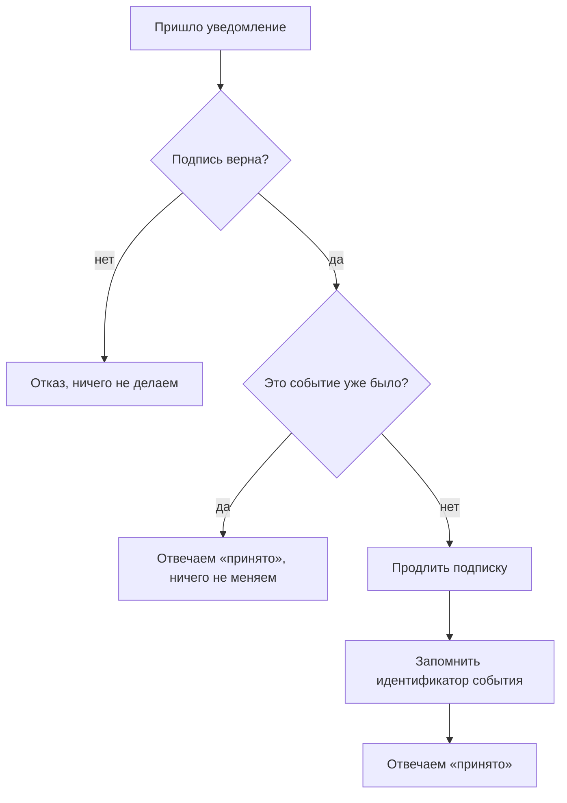

# Вебхуки, идемпотентность, сверка

## Ситуация

Клиент оплатил. Касса отправила вам уведомление. Вы включили тариф на месяц.

Через минуту касса отправила то же самое уведомление ещё раз — так работают все платёжные системы, они повторяют отправку, пока не получат подтверждение. Ваш код добросовестно добавил ещё месяц.

Бывает и обратное: уведомление не дошло вовсе. Человек заплатил, доступа нет, и он пишет в поддержку.

## Зачем это нужно

У одной оплаты три разные проблемы, и закрываются они тремя разными механизмами.

**Вебхук** — способ кассы сообщить вам о событии. Она сама обращается к вашему адресу: «платёж такой-то прошёл». Это избавляет от необходимости постоянно опрашивать её кабинет.

**Проверка подписи** отвечает на вопрос «это действительно касса?». Без неё любой человек может отправить вам сообщение «я оплатил» и получить тариф бесплатно.

**Идемпотентность** гарантирует, что повторная обработка того же события ничего не изменит. Достигается просто: вы запоминаете идентификаторы обработанных событий.

**Сверка** — регулярное сравнение выгрузки кассы с вашей таблицей. Она ловит то, что потерялось.

### Кто за что отвечает

| Механизм | Какую беду закрывает |
|---|---|
| Вебхук | не надо опрашивать кассу постоянно |
| Проверка подписи | поддельное уведомление |
| Идемпотентность | двойное начисление |
| Сверка | потерянное уведомление |

Убрать любой — и появится своя категория проблем.

!!! danger "Адрес вебхука должен быть по HTTPS"
    Касса не будет отправлять уведомления на незащищённый адрес или на адрес с портом вроде 8080. Поэтому модуль 5 с доменом и сертификатом — обязательная предпосылка для приёма платежей.

!!! note "Новые слова"
    - **Вебхук** — обращение стороннего сервиса к вашему адресу при наступлении события.
    - **Подпись** — контрольная сумма, подтверждающая отправителя.
    - **Идентификатор события** — уникальный номер уведомления.

## Как это устроено



Важная деталь: отвечать надо «принято» в обоих случаях — и когда обработали, и когда событие повторилось. Если ответить ошибкой, касса пришлёт уведомление снова.

### Псевдокод, который стоит понимать

```
проверить подпись; если неверна — отказ
если идентификатор события уже в таблице — ответить «принято» и выйти
продлить срок подписки
записать идентификатор события в таблицу
ответить «принято»
```

Восемь строк. Важнее выбора библиотеки — именно этот порядок.

!!! warning "Про содержимое логов"
    В уведомлении есть персональные данные. В лог записывайте идентификатор события и его тип, но не всё сообщение целиком.

## Практика

### Шаг 1. Разобрать, где нужен уникальный ключ

Ключевая деталь идемпотентности — ограничение на уровне базы: идентификатор события может встречаться только один раз.

Без этого ограничения два уведомления, пришедшие одновременно, оба пройдут проверку «было ли такое» и оба начислят месяц.

**Что должно получиться:** понимание, что защита от двойного начисления — это свойство базы, а не аккуратность кода.

### Шаг 2. Посмотреть образец таблицы

**Где смотреть:** папка курса, файл `labs/billing/subscriptions.example.csv`.

**Что должно получиться:** вы видите колонки. Обратите внимание на:

- срок оплаченного доступа;
- идентификатор последнего обработанного события;
- статус.

### Шаг 3. Спланировать сверку

Сверка — это сравнение двух списков:

| Откуда | Что берём |
|---|---|
| Кабинет кассы | выгрузка платежей за период |
| Ваша таблица | подписки с датами оплаты |

Что ищем:

- платёж есть у кассы, но подписка не продлена — потерянное уведомление, надо продлить;
- подписка продлена, платежа нет — ошибка или злоупотребление, надо разбираться;
- суммы не совпадают — вопрос к бухгалтерии.

**Что должно получиться:** понимание, что сверка — ритуал на пятнадцать минут раз в неделю, а не героическая операция раз в год.

### Шаг 4. Записать план в инвентарь

Три строки:

1. Адрес, на который будут приходить уведомления, — по HTTPS.
2. День недели для сверки.
3. Что делать при расхождении — кому и куда написать.

## Проверка

- [ ] Вы знаете четыре механизма и что закрывает каждый.
- [ ] Понимаете, почему на повтор отвечают «принято», а не ошибкой.
- [ ] Знаете, что защита от дублей обеспечивается базой.
- [ ] Можете описать процедуру сверки.
- [ ] Понимаете, почему адрес уведомлений должен быть защищённым.

## Частые ошибки

!!! failure "Не поставить ограничение уникальности на идентификатор события"
    Рано или поздно придут два одинаковых уведомления, и клиент получит двойной срок.

!!! failure "Включать подписку на странице «спасибо»"
    Этот адрес может открыть кто угодно. Доступ включается только по проверенному уведомлению.

!!! failure "Отвечать ошибкой на повторное уведомление"
    Касса воспримет это как неудачу и будет присылать его снова и снова.

!!! failure "Сверять раз в год"
    Расхождения копятся, и разобраться в них через год уже невозможно.

!!! failure "Записывать в лог всё уведомление целиком"
    Там персональные данные, а логи вы потом кому-нибудь покажете при разборе.

## Как это в больших командах

Уведомления складываются в очередь и обрабатываются отдельно от приёма, чтобы ответить кассе мгновенно. Сверка происходит автоматически каждую ночь, а расхождения превращаются в задачи.

Три слова остаются теми же: подпись, идемпотентность, сверка.

## Итог

Событие обрабатывается ровно один раз. Истина — это касса плюс ваша таблица, а не ощущения и не переписка с клиентом.

Дальше — юридическая сторона и админка.

Далее: [Юристы и админка](04-yuristy-i-adminka.md).

!!! info "Нагрузка на учебный VPS"
    **Только теория.**
