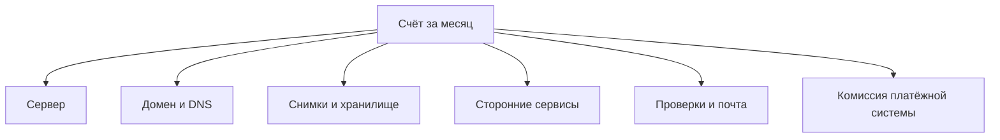

# Из чего складывается счёт

## Ситуация

Сервер стоит двести рублей в месяц — так написано на сайте хостера. Кажется, что это и есть стоимость проекта.

В конце месяца выясняется, что к этому добавились домен, снимок диска, оплата за обращения к нейросети и почтовый ящик. А ещё обнаружился второй сервер, который вы заводили «на попробовать» два месяца назад.

Самое неприятное решение в такой ситуации — выключить что-нибудь полезное. Обычно под нож идёт то, что выглядит необязательным: уведомления о недоступности. Хотя стоили они меньше, чем забытый сервер.

## Зачем это нужно

Счёт за проект — это сумма привычек, а не одна цифра с сайта хостера. Расходы делятся на три группы, и опаснее всего третья.

**Постоянные** — капают каждый месяц независимо от того, заходил кто-нибудь или нет: сервер, домен, почта.

**Переменные** — по факту использования: обращения к нейросети, трафик сверх пакета, объём в облачном хранилище.

**Скрытые** — то, о чём вы забыли: снимок диска, сделанный «на всякий случай» полгода назад, тестовый сервер, пробный период, который тихо перешёл в платный.

### Типичные строки счёта

| Строка | Группа | Порядок суммы |
|---|---|---|
| Сервер | постоянная | сотни рублей |
| Домен | постоянная | в год, но платить надо |
| Снимки диска | скрытая | десятки рублей, накапливается |
| Обращения к нейросети | переменная | может быть любой |
| Внешняя проверка доступности | постоянная | часто бесплатно |
| Комиссия платёжной системы | переменная | процент с оборота |

Последняя строка появляется вместе с модулем 15. Это не инфраструктура, но тот же кошелёк.

!!! warning "Экономия не должна ломать надёжность"
    Сэкономить полсотни рублей ценой отсутствия резервной копии — плохая сделка. Час простоя или потерянные данные обойдутся дороже.

!!! note "Новые слова"
    - **Постоянные расходы** — не зависят от использования.
    - **Переменные расходы** — зависят от объёма работы.
    - **Скрытые расходы** — забытые ресурсы, за которые продолжают списывать.

## Как это устроено

Для учебного проекта реальный минимум — сервер плюс домен. «Пульс» почти ничего не добавляет сверху.

## Практика

### Шаг 1. Собрать все кабинеты

Откройте по очереди:

- кабинет хостера;
- кабинет регистратора домена;
- кабинет поставщика нейросети, если пользуетесь;
- прочие сервисы проекта.

**Что должно получиться:** список мест, где с вас могут списать деньги. Уже на этом этапе часто обнаруживается забытое.

### Шаг 2. Проверить, нет ли лишних ресурсов

**Зачем:** скрытые расходы находят именно так.

**Где смотреть:** панель хостера, список серверов и снимков.

Ответьте на три вопроса:

- все ли серверы в списке используются;
- сколько снимков дисков хранится и сколько они стоят;
- нет ли оплаченных услуг, которыми вы не пользуетесь.

**Что должно получиться:** возможно, вы найдёте что-то лишнее. Это самая прибыльная минута всего модуля.

### Шаг 3. Записать три суммы

Заведите в инвентаре табличку:

| Что | Сумма в месяц |
|---|---|
| Постоянные | |
| Переменные, в среднем | |
| **Итого** | |

**Что должно получиться:** реальная стоимость вашего проекта. Скорее всего, она отличается от той цифры, которую вы держали в голове.

### Шаг 4. Посчитать годовой сценарий

**Зачем:** понять цену забывчивости.

Умножьте итог на двенадцать.

**Что должно получиться:** сумма, которую вы потратите, если ничего не менять год. С ней проще принимать решения о том, что стоит оставить, а что выключить.

### Шаг 5. Проверить лимиты бесплатных сервисов

**Где смотреть:** условия использования GitHub, внешней проверки доступности и прочих бесплатных инструментов.

**Что должно получиться:** понимание, где у бесплатного тарифа потолок. Например, у публикации сайта и автоматических сборок есть ограничения по объёму.

## Проверка

- [ ] Вы называете не одну цифру, а список строк.
- [ ] Проверили, нет ли забытых ресурсов.
- [ ] Итоговая сумма записана в инвентарь.
- [ ] Знаете годовой порядок затрат.
- [ ] Выяснили потолки бесплатных сервисов.

## Частые ошибки

!!! failure "Считать только тариф сервера"
    Домен, снимки и сторонние сервисы легко удваивают сумму.

!!! failure "Выключить уведомления ради экономии"
    Один час незамеченного простоя стоит дороже, чем месяц любых проверок.

!!! failure "Забыть про пробные периоды"
    Бесплатный период заканчивается тихо, а списание начинается автоматически.

!!! failure "Держать снимки дисков вечно"
    Они занимают место и стоят денег. Один актуальный снимок полезен, десять прошлогодних — нет.

## Как это в больших командах

Существует отдельная дисциплина управления расходами на инфраструктуру: ресурсы помечают, чтобы понимать, какая команда сколько тратит, и устанавливают бюджеты.

Ваш вариант — одна таблица и пометка «учебный сервер».

## Итог

Счёт складывается из привычек. Скрытые расходы находятся простым просмотром кабинетов.

Дальше — как сделать, чтобы сумма не становилась сюрпризом.

Далее: [Биллинг-алерты и календарь](02-billing-i-kalendar.md).

!!! info "Нагрузка на учебный VPS"
    **Нулевая.**
