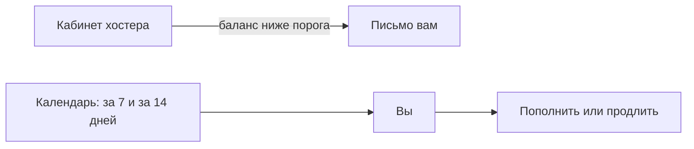

# Биллинг-алерты и календарь

## Ситуация

Сайт перестал открываться. Вы проверяете логи, контейнеры, файрвол — всё в порядке.

Потом заходите в панель хостера и видите: баланс ушёл в минус, сервер выключен за неуплату.

Это обидный вид простоя: он полностью предотвратим и не имеет отношения к технике.

## Зачем это нужно

Статистика простая: хостер выключает машину за неоплату чаще, чем происходят настоящие технические аварии. Домен с истёкшим сроком ломает и сайт, и почту, и сертификат разом.

Защита состоит из двух частей.

**Уведомления от сервисов** — письмо «баланс ниже такой-то суммы» или «скоро списание». Их надо включить и настроить порог осмысленно.

**Собственный календарь** — даты, о которых надо помнить: оплата сервера, продление домена, срок действия карты, еженедельный просмотр показателей.

### Четыре даты, которые должны быть в календаре

| Событие | Когда напоминать |
|---|---|
| Оплата сервера | за 7 дней |
| Продление домена | за 14 дней |
| Окончание срока карты | за 30 дней |
| Еженедельный просмотр | каждую неделю |

Про карту забывают чаще всего. Автопродление с истёкшей картой не сработает, и списание просто не пройдёт.

!!! warning "Автопродление не отменяет напоминание"
    Регистраторы и хостеры тоже ошибаются, а автопродление зависит от рабочей карты. Напоминание — это страховка, а не дублирование.

!!! note "Новые слова"
    - **Порог баланса** — сумма, при достижении которой приходит уведомление.
    - **Автопродление** — автоматическое списание за следующий период.

## Как это устроено

**Скриншот:** раздел уведомлений в панели хостера. Ищите слова «уведомления», «порог баланса», «автопродление».

## Практика

### Шаг 1. Включить уведомление о балансе

**Где делать:** панель хостера, раздел уведомлений или настроек аккаунта.

Что указать:

- канал — почта, а если есть возможность, ещё и Telegram;
- порог — сумма чуть больше месячного тарифа.

**Что должно получиться:** включённое уведомление. Порог в один рубль бесполезен: к моменту письма у вас уже не останется времени на реакцию.

### Шаг 2. Проверить, какая почта получает письма

**Зачем:** уведомление, приходящее в ящик, который вы не открываете, — это отсутствие уведомления.

**Где смотреть:** настройки аккаунта хостера, контактный адрес.

**Что должно получиться:** адрес, который вы действительно читаете. Запишите его в инвентарь.

!!! danger "Почта для восстановления паролей — критичный ресурс"
    Через этот ящик восстанавливаются доступы ко всему остальному. У него должен быть надёжный пароль и второй фактор.

### Шаг 3. Проверить срок действия карты

**Где смотреть:** раздел способов оплаты в панели хостера.

**Что должно получиться:** дата окончания карты. Поставьте напоминание за месяц до неё.

### Шаг 4. Завести четыре напоминания

**Где делать:** ваш календарь.

Создайте повторяющиеся события по таблице выше.

**Что должно получиться:** четыре записи. В описании каждой полезно указать, что именно делать: ссылку на кабинет и сумму.

### Шаг 5. Проверить срок домена

**Где смотреть:** кабинет регистратора.

**Что должно получиться:** дата окончания регистрации. Убедитесь, что включено автопродление, и всё равно поставьте напоминание.

### Шаг 6. Проверить сертификат

**Зачем:** Caddy обновляет его сам, но убедиться раз в квартал полезно.

**Где смотреть:** замок в адресной строке браузера на вашем сайте.

**Что должно получиться:** дата окончания примерно через три месяца. Если осталось меньше двух недель — обновление не сработало, смотрите [карточку про сертификат](../../runbooks/ssl-expiring.md).

## Проверка

- [ ] Уведомление о балансе включено с осмысленным порогом.
- [ ] Письма приходят на адрес, который вы читаете.
- [ ] Срок действия карты проверен.
- [ ] Четыре напоминания стоят в календаре.
- [ ] Проверены сроки домена и сертификата.

## Частые ошибки

!!! failure "Автопродление с карты, за которой не следите"
    Карта истекла — списание не прошло — сервер выключен. Всё это происходит молча.

!!! failure "Держать даты в голове"
    Голова не является резервной копией. Даты живут в календаре.

!!! failure "Поставить порог баланса в один рубль"
    Письмо придёт, когда реагировать уже поздно.

!!! failure "Указать контактом ящик, который не открываете"
    Уведомления будут исправно приходить в пустоту.

## Как это в больших командах

Облачные провайдеры позволяют задавать бюджеты и присылают предупреждение при приближении к ним. Об этом будет в модуле 19.

Идея та же самая, что и в панели вашего хостера: узнать о деньгах до того, как что-то выключится.

## Итог

Уведомление о деньгах плюс четыре даты в календаре. Это защищает от самого обидного вида простоя.

Дальше — как собрать все факты о проекте в одном месте.

Далее: [Живой инвентарь](03-zhivoy-inventar.md).

!!! info "Нагрузка на учебный VPS"
    **Нулевая.**
