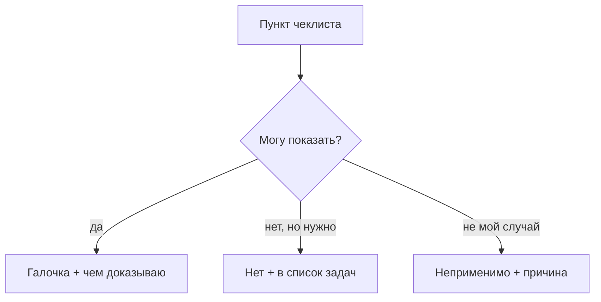

# Полный чеклист

## Ситуация

Дойдя до конца курса, легко поставить галочки по памяти: «бэкап вроде настраивала», «алерты вроде включала».

Проблема в том, что такой чеклист создаёт ощущение готовности, которого нет. А проверяет его не преподаватель, а реальность — обычно в неудобный момент.

## Зачем это нужно

Правило одно: галочка ставится только тогда, когда вы можете показать доказательство.

**Доказательство** — это команда, вывод которой видно, открывающийся адрес, файл с датой или запись в инвентаре. Формулировка «я помню, что делала» доказательством не является.

Есть и второй вариант ответа, не менее честный.

**Неприменимо** — пункт не относится к вашему проекту. Кассы нет, значит, вопросы про приём платежей не открываются. Это лучше, чем ложная галочка: вы явно зафиксировали, что знаете о пункте и почему он не ваш.

### Три колонки вместо двух

| Ответ | Когда ставится |
|---|---|
| Да | есть доказательство, которое можно показать |
| Нет | честно не сделано, знаю и записала |
| Неприменимо | не относится к проекту, причина записана |

!!! danger "Что останавливает диплом"
    Есть пункты, «нет» по которым перевешивает всё остальное:

    - вход на сервер под root по паролю;
    - секреты в репозитории;
    - копии, которые ни разу не восстанавливали.

    Красивый опубликованный учебник эти три строки не компенсирует.

!!! note "Новые слова"
    - **Доказательство** — наблюдаемый факт, а не воспоминание.
    - **Неприменимо** — осознанный отказ от пункта с записанной причиной.

## Как это устроено

Модули 13–16 не добавили новых пунктов в чеклист, но добавили смысла старым: пункты про рост, про людей и про деньги теперь читаются иначе.

Кубернетес и облака в обязательный список не входят. Проект на одном гигабайте оперативной памяти защищается без них.

## Практика

### Шаг 1. Открыть чеклист

**Где смотреть:** [страница чеклиста](../../checklists/production.md) в этом курсе.

**Что должно получиться:** список пунктов перед глазами. Копировать его к себе не обязательно — важнее следующий шаг.

### Шаг 2. Завести таблицу ответов

Три колонки: пункт, ответ, доказательство.

**Что должно получиться:** пустая таблица. Заполнять её будем по одному пункту, не пачкой.

### Шаг 3. Пройти сверху вниз

Правило прохода: на каждом пункте сначала показываете доказательство, потом ставите отметку. Не наоборот.

Примеры того, что считается доказательством:

| Пункт | Чем доказывается |
|---|---|
| Вход по ключу | строка `PermitRootLogin no` в настройках |
| Файрвол | вывод `sudo ufw status` |
| Автоподъём | сервис живой после перезагрузки |
| Копии | архив на компьютере и дата проверки восстановления |
| Сигнал о сбое | сообщение в Telegram, полученное при учебной остановке |

**Что должно получиться:** заполненная таблица без пункта «ну почти».

### Шаг 4. Отдельно отметить блокирующие пункты

**Зачем:** отделить «доделаю потом» от «нельзя оставлять».

Пройдите по трём красным строкам из предупреждения выше и убедитесь, что по ним стоит «да».

**Что должно получиться:** либо три галочки, либо конкретный список того, что надо исправить до защиты.

### Шаг 5. Перенести «нет» в задачи

Каждое «нет» превращается в строку с датой, когда вы к нему вернётесь.

**Что должно получиться:** короткий список. Это и есть ваш план после курса.

## Проверка

- [ ] Каждая галочка подкреплена доказательством.
- [ ] Пункты «неприменимо» снабжены причиной.
- [ ] По трём блокирующим пунктам стоит «да».
- [ ] Все «нет» попали в список задач с датами.
- [ ] Ни одной отметки «ну почти».

## Частые ошибки

!!! failure "Отметить копии без проверки восстановления"
    Модуль 6 говорит об этом прямо: копия, которую не восстанавливали, копией не считается.

!!! failure "Отметить сигнал о сбое, потому что бот создан"
    Бот без задания в планировщике молчит. Доказательство — полученное сообщение.

!!! failure "Ставить галочки пачкой в конце"
    Так работает память, а не проверка. Идти надо по одному пункту.

!!! failure "Стесняться отметки «неприменимо»"
    Честный отказ с причиной выглядит сильнее, чем галочка, за которой ничего нет.

## Как это в больших командах

Перед запуском проводят формальную проверку готовности: те же вопросы про секреты, копии, сигналы и возможность откатиться. Решение принимается коллегиально.

Смысл идентичен вашему листу на одной странице.

## Итог

Чеклист — это экзамен с доказательствами. Пройденный честно, он даёт настоящее представление о состоянии проекта.

Дальше — первое дипломное изделие: живой сервис.

Далее: [Диплом: сервис](02-diplom-servis.md).

!!! info "Нагрузка на учебный VPS"
    **Только просмотр того, что уже работает.**
