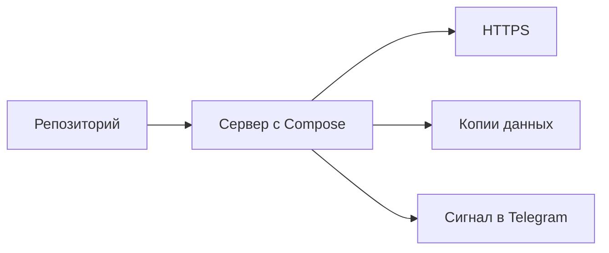

# Диплом: сервис на VPS

## Ситуация

Дипломом здесь считается не количество пройденных модулей, а работающий сервис, который переживает перезагрузку, имеет копии данных и подаёт сигнал, когда ломается.

Проверяете вы его сами, и единственный способ сделать это честно — показать, а не вспомнить.

## Зачем это нужно

Курс существует ради привычек, а не ради меню с галочками. Дипломная защита — момент, когда привычки становятся видимыми.

Уровни готовности удобно разделить на три.

| Уровень | Что в него входит |
|---|---|
| Минимальный | контейнеры, автоподъём, секреты вне репозитория, проверенная копия, умение читать логи, адрес состояния, вход по ключу, файрвол |
| Хороший | плюс защищённое соединение, сигнал в Telegram, живой инвентарь, записанный показатель надёжности |
| Отличный | плюс опубликованный учебник, описанная вторая среда, умение отозвать чужой ключ |

Минимальный уровень — это уже защищаемый результат. Остальное приятно, но не обязательно.

!!! warning "Свой проект вместо «Пульса» — можно, если он помещается"
    Если ваш проект влезает в один гигабайт оперативной памяти, защищайте на нём. Если нет — защищайтесь на «Пульсе», а для своего проекта составьте план роста из модуля 13. Затаскивать тяжёлый набор сервисов на учебный сервер ради красивой защиты не нужно: остановка по нехватке памяти не является оценкой.

!!! note "Новые слова"
    - **Дипломный контур** — минимальный набор свойств, при которых сервис можно считать живущим самостоятельно.

## Как это устроено



Ключевое свойство всей схемы: она работает при закрытом ноутбуке. Если для жизни сервиса нужно, чтобы у вас было открыто окно терминала, дипломный контур не собран.

## Практика

### Шаг 1. Проверить автоподъём перезагрузкой

**Зачем:** это самая честная проверка из всех.

**Где делать:** панель хостера, кнопка перезагрузки сервера.

Подождите пару минут и откройте адрес сервиса.

**Что должно получиться:** сайт открывается сам, без вашего вмешательства. Если пришлось заходить и запускать руками — возвращайтесь к модулю 4.

### Шаг 2. Открыть сервис с телефона

**Зачем:** проверить, что сервис доступен снаружи, а не только из вашей сети.

**Где делать:** телефон, лучше через мобильный интернет, а не домашний Wi-Fi.

**Что должно получиться:** страница открывается, рядом с адресом виден замок.

### Шаг 3. Показать копию и дату восстановления

**Где вводить:** PowerShell на вашем компьютере

```powershell
Get-ChildItem .\backups\ | Sort-Object LastWriteTime -Descending | Select-Object -First 3
```

**Что должно получиться:** список последних архивов с датами. Плюс запись в инвентаре о дате, когда восстановление проверялось.

### Шаг 4. Проверить сигнал о сбое

**Где вводить:** терминал сервера (`ssh ucheb`)

```bash
cd /opt/pulse && docker compose stop
```

Подождите несколько минут.

**Что должно получиться:** сообщение в Telegram. После этого обязательно верните сервис:

```bash
docker compose start
```

**Что должно получиться:** сервис снова отвечает, а вы точно знаете, что сигнальная цепочка работает.

!!! warning "Не забудьте запустить обратно"
    Остановленный ради проверки сервис легко оставить остановленным. Проверьте адрес состояния после запуска.

### Шаг 5. Показать настройки доступа

**Где вводить:** терминал сервера (`ssh ucheb`)

```bash
sudo ufw status && sudo grep -E "PermitRootLogin|PasswordAuthentication" /etc/ssh/sshd_config
```

**Что должно получиться:** открыты только нужные порты, вход под root запрещён, вход по паролю выключен.

### Шаг 6. Записать защиту в инвентарь

Одна строка: «диплом сервиса пройден, дата такая-то, уровень такой-то».

**Что должно получиться:** запись, к которой можно вернуться через полгода и понять, в каком состоянии вы оставили проект.

## Проверка

- [ ] Сервис пережил перезагрузку без вашего участия.
- [ ] Открывается с телефона, защищённое соединение работает.
- [ ] Есть архивы с датами и проверенное восстановление.
- [ ] Сигнал о сбое получен на практике.
- [ ] Файрвол и настройки входа показаны.
- [ ] Защита записана в инвентарь.

## Частые ошибки

!!! failure "Считать дипломом чужой скриншот панели мониторинга"
    У вас может не быть тяжёлой системы наблюдения, и это нормально. Диплом — ваш работающий сервис, а не чужая картинка.

!!! failure "Поставить тяжёлый набор сервисов ради защиты"
    На одном гигабайте это закончится остановкой по нехватке памяти прямо во время проверки.

!!! failure "Проверять автоподъём «мысленно»"
    Перезагрузка занимает две минуты и отвечает на вопрос окончательно.

!!! failure "Оставить сервис остановленным после проверки сигнала"
    Классика. Всегда проверяйте адрес состояния в конце.

## Как это в больших командах

Перед выводом сервиса в работу проводят проверку готовности: смотрят на секреты, копии, сигналы, возможность отката и дежурство.

Список вопросов у вас тот же, просто короче.

## Итог

Сервис живёт без открытого ноутбука, восстанавливается из копии и сообщает о поломке. Это и есть дипломный результат.

Дальше — второе изделие: сам учебник.

Далее: [Диплом: Pages](03-diplom-pages.md).

!!! info "Нагрузка на учебный VPS"
    **Перезагрузка и короткая остановка сервиса — запланированное окно.**
