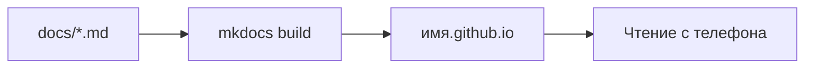

# Диплом: учебник на GitHub Pages

## Ситуация

Весь курс вы читали по адресу вида `127.0.0.1:8000` — то есть с собственного компьютера. Стоит его выключить, и учебника нет.

Второе дипломное изделие устраняет это: тот же текст становится сайтом, который открывается с телефона и из любой точки.

## Зачем это нужно

Публикация учебника — не украшение, а повторение того же цикла, что и с сервисом, только на другом материале:

| Этап | «Пульс» | Учебник |
|---|---|---|
| Источник | код в репозитории | файлы `docs/*.md` |
| Сборка | образ контейнера | `mkdocs build` |
| Где работает | ваш сервер | серверы GitHub |
| Как открывают | домен по HTTPS | адрес вида `имя.github.io` |

Главная разница в последней строке: учебник не потребляет ресурсы вашего сервера. Для машины на один гигабайт это существенно.

!!! note "Новые слова"
    - **Статический сайт** — набор готовых файлов, которым не нужна работающая программа на сервере.
    - **Документация как код** — подход, при котором текст живёт в репозитории и собирается автоматически.

## Как это устроено



Если публикация на GitHub по каким-то причинам недоступна, есть равноценный запасной вариант: отдавать папку `site/` через ваш Caddy, закрыв её простым паролем. Как это делается, описано на странице про [доступ другим людям](../../access-later.md). Это тоже полноценная выкладка статики.

## Практика

### Шаг 1. Собрать сайт локально

**Где вводить:** PowerShell на вашем компьютере, в папке проекта, с активированным окружением

```powershell
mkdocs build --strict
```

**Что должно получиться:** сборка завершается без ошибок. Строгий режим специально не прощает битые ссылки — если он ругается, сначала чиним, потом публикуем.

### Шаг 2. Проверить адрес сайта в настройках

**Где смотреть:** файл `mkdocs.yml`, параметр `site_url`.

**Что должно получиться:** там указан будущий публичный адрес, а не `localhost`. Иначе некоторые ссылки на опубликованном сайте поведут не туда.

### Шаг 3. Убедиться, что в репозитории нет лишнего

**Где вводить:** PowerShell на вашем компьютере, в папке проекта

```powershell
git status --ignored --short | Select-String "\.env|\.venv|site/"
```

**Что должно получиться:** эти пути должны быть помечены как игнорируемые. Если какой-то из них готовится к отправке — правьте `.gitignore` до публикации.

### Шаг 4. Поискать секреты в истории

**Зачем:** опубликованный репозиторий читают все, включая автоматических сборщиков чужих ключей.

**Где вводить:** PowerShell на вашем компьютере, в папке проекта

```powershell
git grep -I -n "BEGIN OPENSSH" ; git grep -I -n "TELEGRAM_BOT_TOKEN="
```

**Что должно получиться:** ничего не найдено, либо найдены только строки из примеров с пустыми значениями. Настоящий ключ в истории — повод не публиковать репозиторий и сначала отозвать ключ.

!!! danger "Удалить файл недостаточно"
    Если секрет когда-то попадал в коммит, он остаётся в истории. Правильное действие — считать его скомпрометированным и заменить, а не пытаться подчистить.

### Шаг 5. Опубликовать

Порядок действий подробно разобран в [лаборатории 8](../../labs/lab-08-pages-i-deploy.md). Здесь задача — довести дело до открывающегося адреса.

**Что должно получиться:** ссылка вида `https://имя.github.io/название/`, которая открывается.

### Шаг 6. Проверить с телефона вне домашней сети

**Зачем:** исключить случай, когда сайт «работает», потому что вы смотрите его со своего компьютера.

Откройте адрес с телефона через мобильный интернет, в режиме инкогнито.

**Что должно получиться:** оглавление курса читается, переходы между уроками работают, замок в адресной строке на месте.

### Шаг 7. Записать адрес в инвентарь

**Что должно получиться:** строка с адресом учебника рядом с адресом сервиса. Два адреса — два дипломных изделия.

## Проверка

- [ ] `mkdocs build --strict` проходит без ошибок.
- [ ] `site_url` указывает на публичный адрес.
- [ ] `.env`, `.venv` и `site/` не отправляются в репозиторий.
- [ ] Поиск по репозиторию не находит настоящих ключей.
- [ ] Адрес открывается с телефона в инкогнито.
- [ ] Ссылка записана в инвентарь.

## Частые ошибки

!!! failure "Залить папку site/ руками и потерять исходники"
    Потом невозможно поправить урок. Источник правды — папка `docs`, а `site` собирается из неё.

!!! failure "Опубликовать репозиторий с заполненным инвентарём"
    Там IP и описание доступов. Либо чистим, либо делаем репозиторий закрытым.

!!! failure "Оставить site_url с localhost"
    Часть ссылок и карта сайта будут указывать на ваш компьютер.

!!! failure "Проверять только у себя в браузере"
    Кеш браузера умеет показывать то, чего уже нет. Инкогнито и телефон честнее.

## Как это в больших командах

Документацию хранят вместе с кодом и собирают тем же способом, что и сервисы. Отдельные редакторы и отдельные порталы постепенно исчезли.

Вы только что прошли этот путь целиком.

## Итог

Учебник — тоже рабочий сервис, просто без базы данных. Открытый с телефона, он показывает это нагляднее любых объяснений.

Далее: [Лаборатория. Защита диплома](../../labs/lab-17-diplom.md).

!!! info "Нагрузка на учебный VPS"
    **Нулевая — сборка идёт не на вашем сервере.**
