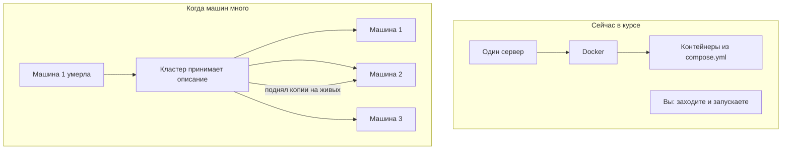

# Какую боль закрывает Kubernetes и чем он не Compose

## Ситуация

Слово Kubernetes встречается в каждой второй вакансии, и от этого возникает неприятное ощущение: все что-то знают, а вы запускаете контейнеры одной командой на одном сервере — значит, делаете по-детски.

Ощущение ложное. Ваш способ правильный для вашего масштаба. Но понимать, какую задачу решает кластер, полезно — хотя бы чтобы осознанно отказываться.

## Зачем это нужно

Сравнивать надо не «просто» и «сложно», а разные задачи.

**Compose** решает задачу списка на **одной** машине: какие контейнеры запустить, какие папки к ним подключить, какой поставить предел памяти, как поднять всё после перезагрузки.

Присматривает за этим Docker на вашей Ubuntu, а строка `restart: unless-stopped` говорит ему поднимать упавшее. Если эта Ubuntu выключена — присматривать некому. Для одной машины это честный и взрослый ответ.

**Kubernetes** решает другую задачу: поддержание желаемого состояния на **нескольких** машинах. Вы не говорите «зайди на третий сервер и запусти контейнер». Вы говорите «хочу, чтобы всегда работало столько-то копий вот такого приложения», а система сама сравнивает реальность с желаемым и устраняет разницу.

### Что кластер действительно умеет

| Возможность | Почему на одной машине не нужна |
|---|---|
| Поднять копии на других машинах, когда одна умерла | других машин нет |
| Выкладка без захода на каждый сервер | сервер один |
| Одинаковые описания для разных сред | сред мало |
| Разделение ресурсов между командами | команда — вы |

### Чего кластер не умеет

Список короче, но важнее:

- не исправляет плохой код;
- не делает резервных копий ваших данных;
- не убирает секреты из репозитория;
- не отвечает на вопрос, нужна ли вам вторая машина.

!!! note "Новые слова"
    - **Желаемое состояние** — описание того, как должно быть, а не список введённых команд.
    - **Нода** — одна машина в общей ферме.
    - **Среда выполнения** — то, что реально крутит контейнер. Kubernetes решает где и сколько, а крутит по-прежнему примерно тот же Docker.

## Как это устроено

По сути это горизонтальное масштабирование из модуля 13, доведённое до автоматики. Пока горизонтали нет, автоматике нечем заниматься — кроме как потреблять память.

## Практика

### Шаг 1. Найти няньку в своём проекте

**Где смотреть:** файл `labs/pulse/compose.yml` в папке курса.

Найдите строку с политикой перезапуска и ответьте на вопрос: что произойдёт с сайтом, если эта операционная система будет выключена?

**Что должно получиться:** ответ «сайт умрёт вместе с ней». Это и есть граница возможностей Compose — и ровно та граница, которую снимает кластер.

### Шаг 2. Сформулировать желаемое состояние словами

Опишите своими словами, как должно быть:

> «Пульс» отвечает на порту 8080, сохраняет заметку в папке данных, Caddy отдаёт его наружу по защищённому соединению.

**Что должно получиться:** три строки. Вы только что написали то, что в кластере записывается в виде файлов описания. Разница в форме, не в мышлении.

### Шаг 3. Проверить, применима ли к вам горизонталь

Ответьте честно:

| Вопрос | Ваш ответ |
|---|---|
| Сколько у вас машин? | |
| Сколько сервисов? | |
| Как часто выкладываете? | |
| Сколько человек в команде? | |

**Что должно получиться:** скорее всего, одна машина, один-два сервиса, выкладки редкие и вы одна. При таких ответах кластер не решает ни одной вашей проблемы.

## Проверка

- [ ] Вы можете объяснить, чем задача Compose отличается от задачи Kubernetes.
- [ ] Понимаете, что контейнер крутит среда выполнения, а кластер решает где и сколько.
- [ ] Знаете четыре вещи, которых кластер не делает.
- [ ] Ответили на четыре вопроса о своём масштабе.

## Частые ошибки

!!! failure "Переписать Compose под кластер на одном гигабайте «чтобы как у взрослых»"
    Взрослые на вашем масштабе как раз оставляют Compose. Это не компромисс, а правильное решение.

!!! failure "Считать, что Kubernetes заменяет Docker"
    Контейнеры всё равно кто-то запускает. Кластер надстраивается сверху, а не вместо.

!!! failure "Думать, что Pod — это виртуальная машина"
    Это обёртка вокруг контейнера. Следующий урок разбирает слова по одному.

## Как это в больших командах

То, что вы в модулях 4–8 делали руками, там делают программы-контроллеры. При этом сами описания желаемого состояния похожи на ваш `compose.yml` — просто подробнее.

## Итог

Compose — список контейнеров на одной машине. Kubernetes — автоматическое поддержание желаемого состояния на ферме машин. Пока ферма не появилась, вторая задача не ваша.

Дальше — словарь, который переводит кластерные слова на уже знакомое.

Далее: [Словарь сущностей](02-sushchnosti.md).

!!! info "Нагрузка на учебный VPS"
    **Только теория, ничего не ставим.**
