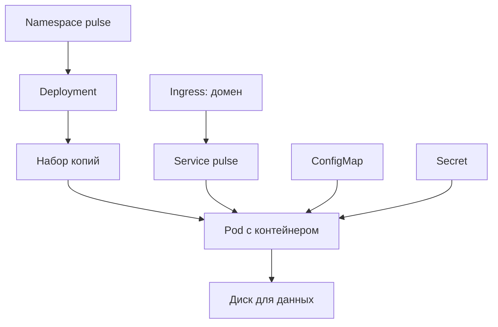

# Словарь сущностей: перевод на язык курса

## Ситуация

Открываешь описание кластера и видишь десяток английских слов: Pod, Deployment, Service, Ingress, PVC. Выглядит как отдельная наука.

На самом деле каждое из этих слов — роль, которую вы уже выполняли руками в модулях 3–7. Кластер просто дал ролям имена и поручил следить за ними программам.

## Зачем это нужно

Читайте список как штатное расписание. У каждого своя работа, а файлы описания — трудовые договоры.

| Слово | Что делает | Что вы уже делали |
|---|---|---|
| Кластер | вся ферма плюс управление | несколько серверов с одним пультом |
| Нода | одна машина фермы | ваш учебный сервер |
| Pod | запускает контейнер прямо сейчас | запущенный контейнер `pulse` |
| Deployment | какой образ, сколько копий, как обновлять | сервис в `compose.yml` |
| Service | постоянное имя и порт внутри | имя `pulse` в сети Docker |
| Ingress | какое доменное имя ведёт на какой сервис | ваш `Caddyfile` |
| ConfigMap | несекретные настройки | переменные в `environment` |
| Secret | секретные значения | файл `.env` |
| PVC | заявка на постоянный диск | строка `./data:/data` |
| Namespace | разделение на зоны | папка `/opt/pulse` |

Две детали из этой таблицы стоит запомнить отдельно, потому что они чаще всего удивляют.

**Pod — временный.** Его могут удалить и создать заново с тем же образом. Поэтому данные внутри Pod держать нельзя — ровно как нельзя держать заметку «Пульса» внутри контейнера без подключённой папки.

**Secret — это не сейф.** Так называется объект хранения, но по умолчанию значение там просто закодировано, а не зашифровано. Защищает не название, а то, кому разрешено его читать.

!!! warning "Почему копий обычно одна"
    Обычный диск в кластере может писаться только с одной машины. Два Pod на разных машинах не смогут писать в один и тот же диск. Это та же ловушка, что в модуле 13: данные в файле плохо размножаются горизонтально.

!!! note "Новые слова"
    - **Манифест** — файл с описанием объекта.
    - **Контроллер** — программа, постоянно сравнивающая желаемое с действительным.

## Как это устроено

Объекты связаны в цепочку, и порядок в ней логичный:

Читается так: Deployment следит, чтобы существовало нужное число Pod. Pod читает настройки и секреты, пишет в диск. Service даёт постоянный адрес живым Pod. Ingress направляет на Service внешний домен.

!!! danger "Ingress без вахтёра не работает"
    Файл с описанием Ingress сам по себе ничего не слушает. Нужна отдельная работающая программа — контроллер. Это ровно как `Caddyfile` без запущенного Caddy: файл есть, а никто не отвечает.

## Практика

### Шаг 1. Открыть два файла рядом

**Где смотреть:** папка курса, файлы `labs/pulse/compose.yml` и `labs/k8s/`.

Откройте их в соседних окнах.

**Что должно получиться:** видно, что это один и тот же сервис, описанный двумя способами. Не два разных мира.

### Шаг 2. Прочитать пояснения к манифестам

**Где смотреть:** файл `labs/k8s/README.md`.

**Что должно получиться:** таблица соответствий перед глазами.

### Шаг 3. Заполнить свою таблицу перевода

Возьмите лист и выпишите десять слов из таблицы выше, а напротив каждого — аналог из вашего проекта.

**Что должно получиться:** десять строк без пропусков. Если аналог не находится — перечитайте описание роли. Зубрить английские слова бесполезно, важна роль.

### Шаг 4. Проверить себя тремя фразами

Произнесите вслух:

1. «Ingress без контроллера — как Caddyfile без запущенного Caddy».
2. «Service — это постоянное имя, потому что Pod временные».
3. «PVC — это моя папка `data`, только выданная кластером».

**Что должно получиться:** три фразы, сказанные без подглядывания. Это и есть усвоенный словарь.

## Проверка

- [ ] Каждому из десяти слов вы нашли аналог из курса.
- [ ] Понимаете, почему Pod считается временным.
- [ ] Знаете, что Secret защищён правами доступа, а не названием.
- [ ] Можете объяснить, почему копия обычно одна при обычном диске.

## Частые ошибки

!!! failure "Ждать публичный адрес от учебного кластера на своём компьютере"
    В песочнице выход наружу обычно устроен иначе — через проброс порта. Отсутствие публичного адреса не означает поломку.

!!! failure "Считать Secret надёжным хранилищем"
    Это объект хранения. Важно, кто имеет право его прочитать.

!!! failure "Учить слова списком без аналогий"
    Через неделю останутся только английские слова без смысла.

## Как это в больших командах

К базовому набору добавляют собственные типы объектов и программы, которые ими управляют. Но разговор про обычный веб-сервис ведётся именно этими десятью словами.

## Итог

Каждый объект кластера — роль, которую вы уже выполняли вручную. Осталось понять, кто в кластере всем этим управляет.

Далее: [Мозг кластера и рабочие машины](03-control-plane.md).

!!! info "Нагрузка на учебный VPS"
    **Теория и чтение файлов.**
