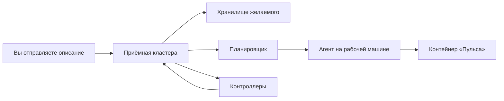

# Мозг кластера и рабочие машины

## Ситуация

Пока кластер воспринимается как «такое облако, куда отправляешь файлы», непонятно главное: почему он требует несколько гигабайт памяти ещё до запуска вашего приложения.

Ответ в том, что кластер состоит из двух разных частей, и одна из них — целая система управления, которая работает всегда.

## Зачем это нужно

Части две, и обязанности у них разные.

**Мозг** — принимает ваши команды, помнит желаемое состояние, решает, на какую машину положить новую копию приложения, замечает умершие. К нему обращается человек, и ему же докладывают рабочие машины.

**Рабочие машины** — крутят контейнеры. Ровно то же, что делает Docker на вашем сервере, только команды поступают от мозга, а не от вас по SSH.

### Из чего состоит мозг

| Часть | Обязанность | Домашний аналог |
|---|---|---|
| Приёмная (API) | принимает все команды | ваш вход по SSH, только один на всю ферму |
| Хранилище состояния | помнит, как должно быть | что-то вроде базы с записями о желаемом |
| Планировщик | выбирает машину для новой копии | вы, решающая, куда ставить сервис |
| Контроллеры | замечают расхождения и чинят | ваши глаза и руки |

### Из чего состоит рабочая машина

| Часть | Обязанность |
|---|---|
| Агент | слушает мозг и запускает контейнеры |
| Сетевой помощник | настраивает правила, чтобы имена сервисов работали |
| Среда выполнения | собственно запускает контейнер |

!!! warning "Что происходит при поломке"
    Умерла рабочая машина — мозг, если жив, переложит копии на другие. Умер мозг — ферма слепнет: контейнеры какое-то время крутятся, но изменить или починить ничего нельзя.

!!! note "Новые слова"
    - **Мозг кластера** (control plane) — управляющая часть.
    - **Рабочая машина** (worker) — та, что крутит приложения.
    - **Файл доступа** (kubeconfig) — пропуск к приёмной кластера.

## Как это устроено



Обратите внимание на важное следствие: вы больше не заходите на каждую машину. Вы обращаетесь в одну приёмную, а дальше разбирается мозг.

### Почему на одном гигабайте не получится

Сложите примерные аппетиты:

| Что | Порядок памяти |
|---|---|
| Операционная система | 200–300 МБ |
| Части кластера, даже облегчённого | от 500 МБ |
| Вахтёр на входе и служба имён | ещё сотни мегабайт |
| Ваш «Пульс» | 64 МБ |

Сумма превышает гигабайт ещё до того, как к сайту пришёл первый посетитель. Мозг может и выживет, а вот ваш вход по SSH — вряд ли. Похожую картину вы уже видели в модуле 10 при разговоре о тяжёлых системах наблюдения.

!!! danger "Файл доступа — ключ от всей фермы"
    Он даёт право управлять всеми приложениями кластера. Хранится как секрет, в репозиторий не попадает никогда. По опасности он превосходит обычный ключ SSH к одному серверу.

## Практика

### Шаг 1. Нарисовать два кружка

Нарисуйте на бумаге мозг и рабочие машины. Подпишите:

- куда вы отправляете описание;
- где реально работает код «Пульса».

**Что должно получиться:** две подписи в разных кружках. Если обе попали в один кружок и это ваш сервер на гигабайт — схема нежизнеспособна.

### Шаг 2. Понять разницу между «своим» и арендованным кластером

| Вариант | Кто отвечает за мозг |
|---|---|
| Собираете сами на своих серверах | вы: обновления, копии состояния, память |
| Берёте у российского облака как услугу | провайдер, вы платите за это отдельно |

**Что должно получиться:** понимание, что фраза «поставлю кластер» означает совершенно разные объёмы работы в этих двух случаях.

### Шаг 3. Посчитать свою память

**Где вводить:** терминал сервера (`ssh ucheb`)

```bash
free -m
```

**Что должно получиться:** видно, сколько памяти всего и сколько свободно. Сравните со столбцом из таблицы выше — и вопрос о кластере на этом сервере закроется окончательно.

### Шаг 4. Записать вывод в инвентарь

Одна строка: «кластер на учебном сервере не ставим — не хватает памяти на управляющую часть».

**Что должно получиться:** решение, зафиксированное письменно. Через полгода, когда снова появится соблазн, вы прочитаете причину.

## Проверка

- [ ] Вы различаете мозг и рабочие машины.
- [ ] Знаете, что будет при смерти каждой из частей.
- [ ] Понимаете, почему кластер не помещается в гигабайт.
- [ ] Знаете, что файл доступа — секрет уровня выше, чем ключ SSH.
- [ ] Решение записано в инвентарь.

## Частые ошибки

!!! failure "Править хранилище состояния кластера руками"
    Это не обычный текстовый файл настроек. В арендованном кластере доступа к нему у вас и не будет.

!!! failure "Положить файл доступа в репозиторий"
    Это ключ от всей фермы. Хуже, чем выложить пароль от одного сервера.

!!! failure "Считать, что кластер заменяет среду выполнения контейнеров"
    Она всё равно работает на каждой рабочей машине, просто получает команды не от вас.

!!! failure "Запускать управляющую часть на машине с приложением ради экономии"
    При нехватке памяти система убьёт что-нибудь важное, и чаще всего это будет не то, что вы ожидаете.

## Как это в больших командах

Управляющую часть дублируют в нескольких дата-центрах, состояние кластера регулярно копируют, а доступ к приёмной закрывают отдельным защищённым входом.

Устройство при этом ровно то же: приёмная, память о желаемом, планировщик, контроллеры.

## Итог

Мозг помнит и командует, рабочие машины крутят контейнеры. Кормить мозг на учебном сервере нечем — и это нормальный, осознанный отказ.

Далее: [Выкладка, обновление и откат](04-deploy-helm-otkat.md).

!!! info "Нагрузка на учебный VPS"
    **Теория, одна безопасная команда.**
