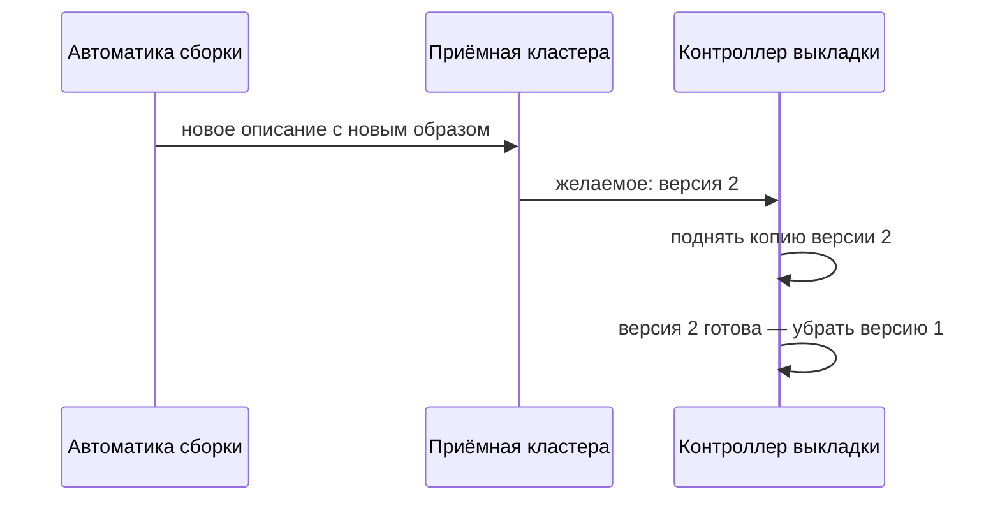

# Выкладка, шаблоны и откат

## Ситуация

В модуле 8 робот выкладывал новую версию так: заходил на сервер и пересобирал контейнеры.

В кластере робот делает то же самое по смыслу, но другим способом: отправляет в приёмную новое описание желаемого состояния. Дальше кластер сам приводит реальность в соответствие.

## Зачем это нужно

Разница в подходе одна, но принципиальная.

**Было:** вы перечисляете команды, которые надо выполнить.

**Стало:** вы описываете результат, а кластер вычисляет, какие действия нужны.

Из этого следует приятное свойство: повторная отправка того же описания ничего не ломает. Если реальность уже совпадает с желаемым, ничего не происходит. Это та же идемпотентность, о которой шла речь в модуле 15, только применительно к инфраструктуре.

### Способы обновления

| Способ | Как работает | Когда подходит |
|---|---|---|
| Волной | новая копия встаёт рядом, потом убирают старую | несколько копий, простоя нет |
| Заменой | сначала убирают старую, потом ставят новую | одна копия и один диск |

Для «Пульса» с одним диском честнее второй способ: две копии всё равно не смогут одновременно писать в один диск.

### Шаблоны

Когда одно и то же приложение описывается для разных сред, появляются шаблоны: одно описание плюс отдельные наборы значений для каждой среды.

Это в точности то же, что вы делали в модуле 7: один `compose.yml`, разные `.env`. Инструмент называется Helm, и он не обязателен — начинать можно с обычных файлов.

!!! danger "Метка образа решает судьбу отката"
    Если образ помечен как «последний», то при откате кластер скачает по тому же имени уже новую версию, и откат ничего не вернёт. Метка должна быть уникальной — обычно это идентификатор коммита.

!!! note "Новые слова"
    - **Манифест** — файл с описанием желаемого.
    - **Реестр образов** — хранилище, откуда кластер берёт собранные образы.
    - **Откат** — возврат к предыдущему описанию.

## Как это устроено

Полный путь во взрослом варианте: сборка собирает образ, кладёт его в реестр, меняет метку в описании и отправляет описание в кластер.

Ваш вариант из модуля 8 — младший брат ровно той же схемы.

!!! warning "Два разных отката"
    Откатить выкладку — вернуть предыдущую версию кода. Это делает кластер.

    Восстановить данные — вернуть содержимое диска из копии. Это модуль 6, и кластер тут не поможет.

    Путать их опасно: откат кода не вернёт испорченную заметку.

## Практика

### Шаг 1. Прочитать описание выкладки

**Где смотреть:** файл `labs/k8s/deployment.yaml` в папке курса.

Найдите в нём:

- число копий;
- имя образа;
- предел памяти.

**Что должно получиться:** все три значения узнаваемы — вы видели их в `compose.yml`.

### Шаг 2. Сравнить с файлом Compose

**Где смотреть:** `labs/pulse/compose.yml`.

Выпишите, что в кластерном описании есть, а в Compose нет.

**Что должно получиться:** как минимум проверки состояния и число копий. Об этом — следующий урок.

### Шаг 3. Проговорить, что делает откат

Ответьте: команда отката вернёт предыдущую версию приложения — но вернёт ли она папку с вашими файлами на компьютере?

**Что должно получиться:** ответ «нет». Репозиторий остаётся источником описаний, а откат в кластере меняет только то, что работает прямо сейчас.

### Шаг 4. Записать правило меток

В инвентарь, в раздел про выкладку:

> Образы помечаем идентификатором коммита, а не словом «последний».

**Что должно получиться:** записанное правило. Оно понадобится, как только появится реестр образов — хоть с кластером, хоть без него.

## Проверка

- [ ] Понимаете разницу между списком команд и описанием желаемого.
- [ ] Знаете два способа обновления и когда какой уместен.
- [ ] Различаете откат кода и восстановление данных.
- [ ] Понимаете, почему метка «последний» ломает откат.
- [ ] Знаете, что шаблоны — это аналог разных `.env`.

## Частые ошибки

!!! failure "Метка «последний» плюс надежда на откат"
    Имя то же, содержимое другое. Кластер скачает новую версию и будет прав.

!!! failure "Две копии при одном обычном диске"
    Вторая копия не сможет подключить диск и будет бесконечно пытаться запуститься.

!!! failure "Считать, что откат вернёт данные"
    Данные возвращаются только из резервной копии.

!!! failure "Начинать изучение с шаблонов"
    Сначала обычные файлы описания. Шаблоны добавляются, когда файлов станет много.

## Как это в больших командах

Распространён подход, при котором репозиторий считается единственным источником правды, а кластер сам подтягивает изменения оттуда.

Вы приняли этот принцип ещё в модуле 8, когда договорились, что правки делаются в репозитории, а не прямо на сервере.

## Итог

Выкладка в кластере — это отправка описания желаемого. Откат возвращает предыдущее описание, но не данные.

Далее: [Проверки, лимиты и вход](05-probes-ingress.md).

!!! info "Нагрузка на учебный VPS"
    **Теория.**
