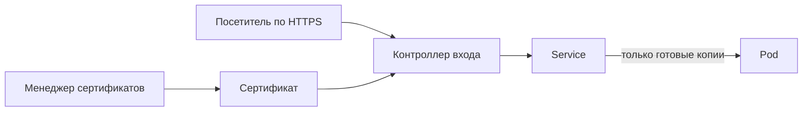

# Проверки, лимиты, вход и сертификаты

## Ситуация

Контейнер запущен, процесс в списке живых, а сайт не отвечает — программа зависла. Docker этого не замечает: с его точки зрения всё в порядке, процесс ведь есть.

Кластер умеет проверять иначе: не «жив ли процесс», а «отвечает ли приложение». Этот механизм и разбираем.

## Зачем это нужно

Три разных механизма решают три разные задачи, и путать их не стоит.

| Механизм | На какой вопрос отвечает | Что происходит при плохом ответе |
|---|---|---|
| Проверка живости | приложение зависло? | контейнер убивают и создают заново |
| Проверка готовности | можно ли уже направлять людей? | трафик временно идёт мимо |
| Проверка запуска | приложение ещё стартует? | остальные проверки ждут |

Разница между первыми двумя важная: одна убивает, вторая просто временно уводит посетителей. Если перепутать, приложение будет перезапускаться в момент, когда ему нужно было просто дать время прогреться.

### Ресурсы

Два числа описывают аппетит приложения.

**Запрос** — сколько памяти и процессора бронируется. По этому числу планировщик решает, на какую машину поместить копию.

**Предел** — потолок. При превышении систему останавливает — ровно как строка `mem_limit: 64m` в вашем `compose.yml`.

Без запроса машины перегружают. Без предела одно жадное приложение душит соседей.

!!! warning "Проверки должны быть дешёвыми"
    Проверка выполняется постоянно, иногда каждые несколько секунд. Если она обращается к базе или к внешнему сервису, вы получите нагрузку на ровном месте, а при малейшем замедлении — лавину перезапусков.

    У «Пульса» адрес состояния лёгкий, и это правильно.

!!! note "Новые слова"
    - **Проба** — регулярный запрос к приложению для оценки его состояния.
    - **Контроллер входа** — программа, принимающая внешние запросы. Аналог вашего Caddy.
    - **Менеджер сертификатов** — программа, автоматически получающая сертификаты. То же, что делает Caddy сам.

## Как это устроено

Важная деталь для планирования ресурсов: контроллер входа и менеджер сертификатов — это тоже работающие программы, которым нужна память. Это третья причина, по которой кластер не помещается на учебный сервер.

Сертификат получают тем же способом, что и у вас в модуле 5: обращением к бесплатному центру сертификации. Просто занимается этим отдельная программа, а не Caddy.

## Практика

### Шаг 1. Найти проверки в кластерном описании

**Где смотреть:** файл `labs/k8s/deployment.yaml`.

Найдите блоки проверок и посмотрите, какой адрес они опрашивают.

**Что должно получиться:** проверки обращаются к `/health` — к тому же адресу, который вы сделали в модуле 4.

### Шаг 2. Найти лимиты

В том же файле найдите блок ресурсов.

**Что должно получиться:** значение вроде 64 МБ. Это перевод строки `mem_limit` из вашего `compose.yml`.

### Шаг 3. Убедиться, что в Compose проверок нет

**Где смотреть:** `labs/pulse/compose.yml`.

**Что должно получиться:** предел памяти есть, а автоматической проверки отвечаемости нет. Compose умеет такое тоже, но в учебной конфигурации это не настроено, и за состоянием следит скрипт из модуля 11.

### Шаг 4. Посмотреть описание входа

**Где смотреть:** файл `labs/k8s/ingress.yaml`.

Сравните его с `labs/pulse/Caddyfile`.

**Что должно получиться:** видно, что оба файла делают одно: связывают доменное имя с внутренним сервисом.

### Шаг 5. Выписать, чего кому не хватает

Две строки:

- чего не хватает описанию Compose — автоматических проверок отвечаемости;
- чего не хватает описанию входа без контроллера — работающей программы, которая действительно слушает порт.

**Что должно получиться:** два вывода. Второй — самая частая причина недоумения новичков в кластере.

## Проверка

- [ ] Вы не путаете проверку живости и проверку готовности.
- [ ] Понимаете разницу между запросом ресурсов и пределом.
- [ ] Знаете, почему проверка должна быть лёгкой.
- [ ] Видите соответствие между описанием входа и `Caddyfile`.
- [ ] Помните, что контроллер входа сам требует памяти.

## Частые ошибки

!!! failure "Направить проверку живости на тяжёлый адрес"
    Приложение работает, но отвечает медленно. Кластер считает его зависшим и убивает. По кругу — и это уже инцидент.

!!! failure "Задать предел без запроса"
    Планировщик не знает, сколько бронировать, и размещение копий становится непредсказуемым.

!!! failure "Открыть служебный порт кластера в интернет навсегда"
    Это возврат к проблемам модуля 4. Для учёбы достаточно проброса порта себе.

!!! failure "Ожидать, что описание входа само поднимет сертификат"
    Сертификатом занимается отдельная программа. Без неё будет обычное незащищённое соединение.

## Как это в больших командах

Проверки и лимиты задают шаблоном для всех сервисов сразу, а правила сетевого доступа описывают отдельно: кто с кем имеет право общаться.

Основа — ровно то, что в этом уроке.

## Итог

Проверки отвечают на вопросы «жив» и «готов», лимиты защищают соседей, вход в кластер устроен как ваш Caddy. Всё это вы уже делали, просто под другими названиями.

Далее: [Когда кластер не нужен](06-kogda-ne-nuzhen.md).

!!! info "Нагрузка на учебный VPS"
    **Теория и чтение файлов.**
