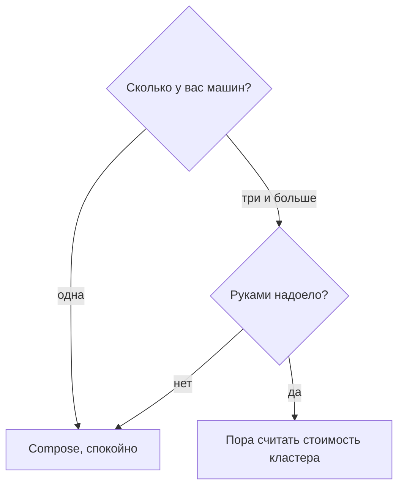

# Когда кластер не нужен

## Ситуация

Самый полезный навык этого модуля — умение отказаться. Кластер в резюме не обслуживает пользователей, если ваш сервис прекрасно живёт на одной машине.

Но отказ должен быть осознанным: не «я боюсь и не буду», а «в моём случае это не решает ни одной задачи, и вот почему».

## Зачем это нужно

Признаки того, что кластер **не нужен** — если верно большинство пунктов:

- у вас одна-две машины;
- один-три сервиса;
- выкладка происходит не каждый час;
- работаете вы одна;
- данные лежат в одной папке;
- Compose вместе с привычками из модулей 6–12 обеспечивает спокойный сон.

Это почти наверняка описание вашего текущего положения.

Признаки того, что **пора задуматься** — не обязательно завтра:

- машин стабильно три и больше, и заходить на каждую надоело;
- сервисов около десятка, и работают с ними разные люди;
- нужно, чтобы тестовая и рабочая среды были устроены одинаково;
- автоматическое добавление машин под нагрузку реально окупается;
- заказчик требует кластер и оплачивает его сопровождение.

### Если всё-таки понадобится

| Вариант | Плюсы | Минусы |
|---|---|---|
| Собрать самой на своих серверах | кажется дешевле | обновления, копии состояния, ночные разборы — ваши |
| Взять как услугу у российского облака | управляющая часть не ваша забота | отдельная плата за управление |
| Учебная песочница в браузере | бесплатно и безопасно | живёт недолго, для знакомства |
| Локальный кластер на своём компьютере | полный контроль | нужно 4 ГБ свободной памяти |

Для знакомства подходят два последних варианта.

!!! danger "Учебный платный кластер удаляют сразу"
    Арендованный кластер с одной машиной, заведённый «посмотреть», выставляет счёт как настоящая рабочая среда. Забытый на месяц, он обойдётся дороже всего вашего курса.

!!! note "Новые слова"
    - **Арендованный кластер** — вариант, где управляющую часть обслуживает провайдер.
    - **Облегчённый кластер** — урезанная сборка для небольших машин. Даже она не помещается в гигабайт.

## Как это устроено

Обратите внимание: в схеме нет ветки «потому что так делают все».

## Практика

### Шаг 1. Пройти по списку признаков

Отметьте, сколько пунктов из первого списка про вас.

**Что должно получиться:** скорее всего, все шесть. Это и есть обоснование отказа.

### Шаг 2. Сформулировать свой критерий

Запишите в инвентарь фразу вида:

> Кластер не ставим, пока у меня меньше трёх серверов и меньше пяти сервисов.

**Что должно получиться:** конкретное условие с числами. Такое решение легко перепроверить через год, а «пока не надо» — нельзя.

### Шаг 3. Посчитать, что бы это стоило

**Где смотреть:** сайт любого российского облака, калькулятор кластера.

Прикиньте стоимость минимальной конфигурации: управляющая часть плюс две-три машины.

**Что должно получиться:** сумма, которую полезно сравнить со строкой «итого» из модуля 16. Обычно разница в разы, и это убедительнее любых слов.

### Шаг 4. Выбрать способ знакомства

Из четырёх вариантов в таблице выберите, как будете щупать кластер в лаборатории.

| Ваш случай | Что выбрать |
|---|---|
| Слабый компьютер | песочница в браузере |
| 4 ГБ свободной памяти и Docker | локальный кластер |
| Нет ни того, ни другого | вариант «только чтение» из лаборатории |

**Что должно получиться:** выбранный вариант. На учебном сервере не делаем ничего.

## Проверка

- [ ] Вы прошли по обоим спискам признаков.
- [ ] Критерий отказа записан числами.
- [ ] Вы прикинули, во сколько обошёлся бы кластер.
- [ ] Выбран способ знакомства из лаборатории.
- [ ] Учебный сервер не тронут.

## Частые ошибки

!!! failure "Завести арендованный кластер и забыть на месяц"
    Счёт придёт как за полноценную рабочую среду. Удаляйте сразу после знакомства.

!!! failure "Считать успехом запуск облегчённого кластера на гигабайте с файлом подкачки"
    Работать это будет медленно и ненадёжно. Файл подкачки — способ выжить, а не способ работать.

!!! failure "Ставить кластер из-за текста вакансии"
    «Рабочая среда на Compose и понимаю, как устроен кластер» — более сильная позиция, чем «однажды запускала учебный кластер».

!!! failure "Откладывать решение формулировкой «пока не надо»"
    Без числового критерия этот вопрос будет возвращаться каждый месяц.

## Как это в больших командах

Там один большой кластер обслуживает отдельная команда, а продуктовые команды только присылают описания своих сервисов.

Вы пока и платформа, и продукт одновременно. Заводить ферму в такой ситуации — значит удвоить себе работу.

## Итог

Compose — ваша рабочая среда. Кластер — инструмент для фермы машин. Отказ, записанный числами, это инженерное решение, а не слабость.

Далее: [Страхи и маркетинг](07-strahi.md).

!!! info "Нагрузка на учебный VPS"
    **Ничего не ставим.**
