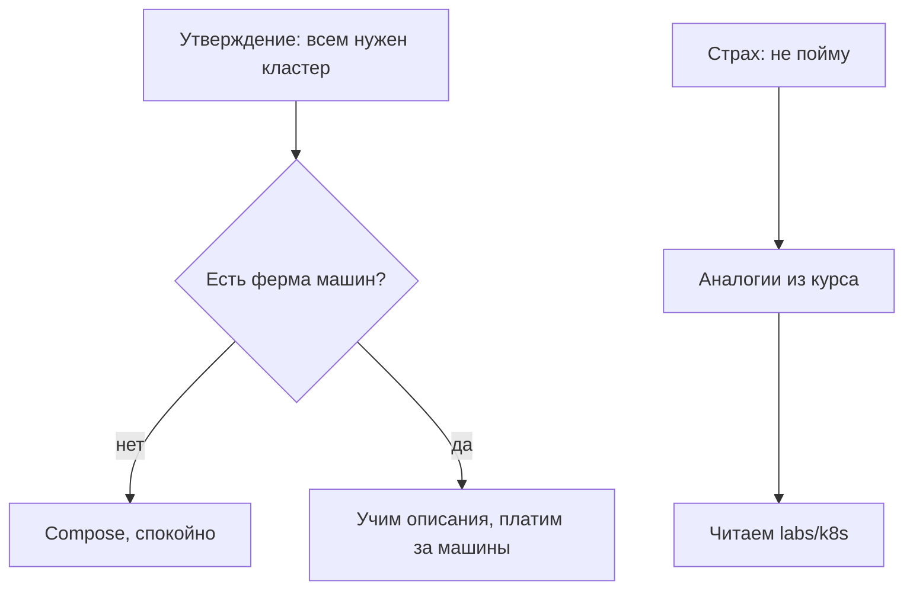

# Страхи и маркетинг вокруг Kubernetes

## Ситуация

Вокруг этой темы много продаж и много стыда. Одни говорят «без кластера ты не в профессии», другие внутренним голосом добавляют «я всё равно не пойму, это не для меня».

Оба голоса приводят к плохим решениям: первый — поставить кластер туда, где он не нужен, второй — никогда не открыть ни одного файла описания.

## Зачем это нужно

Проще всего разобрать утверждения по одному.

| Что говорят | Как обстоит дело |
|---|---|
| «Без кластера ты не инженер» | профессия — это привычки из модулей 0–12, кластер лишь один инструмент |
| «Это же бесплатно, просто файлы» | платите машинами, управляющей частью, временем и сложностью сети |
| «Самовосстановление — можно не дежурить» | сигналы и показатели надёжности никуда не делись, кластер тоже ломается |
| «Я недостаточно умная для этого» | вы уже понимаете контейнеры, вахтёра, лимиты и выкладку — это большая часть смысла |
| «Надо выучить сотни типов объектов» | для обычного веб-сервиса хватает десяти слов из второго урока |
| «Шаблоны сложные, значит я не справлюсь» | шаблоны нужны, когда файлов много, начинают без них |
| «Поставил один раз — и навсегда» | учебные кластеры удаляют, рабочий имеет бюджет как отдельный продукт |

Два страха стоит разобрать отдельно, потому что они встречаются чаще прочих.

**«Файлы описания нечитаемые».** Лечится тем же способом, что и `compose.yml`: один файл — один объект — одна роль. В папке `labs/k8s/` они как раз разбиты по ролям.

**«Отправлю описание и сломаю рабочую среду».** Лечится отдельной зоной для экспериментов, а не отказом разбираться. Причём в вашем случае ломать пока нечего: кластера нет.

!!! note "Новые слова"
    - **Песочница** — временный чужой кластер для экспериментов, который не жалко.

## Как это устроено

Обе ветки ведут к действию, и ни одна — к стыду.

## Практика

### Шаг 1. Записать свой страх

Одно предложение, честно.

**Что должно получиться:** сформулированная фраза. Непроговорённый страх управляет решениями незаметно.

### Шаг 2. Найти ответ в таблице

**Что должно получиться:** либо готовый ответ, либо понимание, что ответа в таблице нет.

Во втором случае ответ обычно даёт практика: полчаса в песочнице снимают мистику лучше любого текста.

### Шаг 3. Потренировать отказ

Представьте, что знакомый предлагает переехать на кластер. Сформулируйте отказ через масштаб:

> У нас один сервер и два сервиса. Кластер добавит управляющую часть, вахтёра и счёт, но не решит ни одной нашей проблемы. Вернёмся к этому, когда машин станет три.

**Что должно получиться:** аргумент про масштаб и числа, а не про «мне сложно».

### Шаг 4. Убрать стыд из формулировок

Сравните две фразы о себе:

| Слабее | Сильнее |
|---|---|
| «Я только на Compose» | «Рабочая среда на Compose, понимаю, какую задачу решает кластер и когда он окупится» |
| «Запускала учебный кластер» | «Разбирала описания сервиса на двух языках и знаю, чем они отличаются» |

**Что должно получиться:** вторая колонка описывает то, что у вас действительно есть после этого модуля.

## Проверка

- [ ] Свой страх сформулирован одним предложением.
- [ ] Для него найден ответ или выбрана практика.
- [ ] Вы можете отказаться от кластера аргументом масштаба.
- [ ] Формулировки о своём опыте не содержат извинений.

## Частые ошибки

!!! failure "Учить материалы к экзамену, не переведя свой сервис на язык кластера"
    Без аналогии это зубрёжка. Сначала перевод знакомого, потом всё остальное.

!!! failure "Стесняться Compose"
    Работающая среда с копиями и сигналами ценнее, чем однажды запущенный учебный кластер.

!!! failure "Откладывать чтение файлов описания «до лучших времён»"
    Они читаются за полчаса. Страх перед ними держится только на неизвестности.

## Как это в больших командах

Там тоже устают от сложности и иногда упрощают архитектуру обратно. Инструмент служит надёжности, а не наоборот.

## Итог

Стыд и маркетинг — плохие архитекторы. Решение принимается по масштабу, а знакомство лучше всего происходит в песочнице.

Далее: [Лаборатория. Песочница](../../labs/lab-18-pesochnica-k8s.md).

!!! info "Нагрузка на учебный VPS"
    **Нулевая.**
