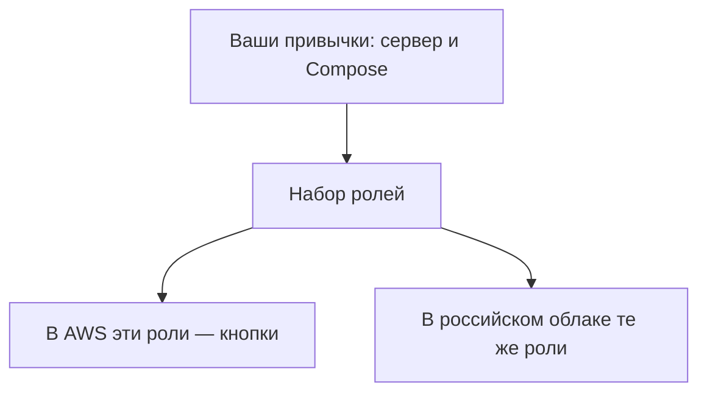

# Зачем нужны большие облака

## Ситуация

Ваш сервер уже стоит в чужом дата-центре, и заводится он кнопкой в панели. В бытовом смысле это и есть облако.

Когда говорят про Amazon, Google или Яндекс, речь идёт о том же жанре, но с меню на сотни пунктов: отдельно машина, отдельно база данных, отдельно хранилище файлов, отдельно очередь задач. Продают это словами «не думайте о железе».

Железо, разумеется, никуда не делось. Его спрятали за прайс-лист.

## Зачем это нужно

Разница между обычным хостером и большим облаком — в том, что именно вам выдают.

| Что покупаете | Обычный хостер | Большое облако |
|---|---|---|
| Компьютер | да | да |
| Хранилище файлов | сами настраиваете | отдельная кнопка |
| База данных с копиями | сами | отдельная кнопка |
| Балансировщик нагрузки | сами | отдельная кнопка |
| Счёт | одна строка в месяц | десятки строк по часам и гигабайтам |

Основные модели продажи принято делить на две.

**Аренда машины** — вам дают компьютер с операционной системой, дальше всё ваше. Ровно то, что у вас сейчас.

**Готовая служба** — вам дают работающую базу данных или кластер, а обновления и резервное копирование берёт на себя провайдер. Меньше работы, больше строк в счёте.

### Зачем в такие облака идут компании

- клиенты по всему миру, нужны дата-центры рядом с ними;
- купить готовую базу с копиями быстрее, чем нанимать специалиста по базам;
- нагрузка скачет, и машины нужны на час, а не на месяц;
- этого требует заказчик.

### Зачем это знать вам, оставаясь на российском хостере

- читать чужие схемы и не теряться;
- понимать, о чём речь в вакансии;
- проверять счета подрядчика;
- узнавать те же самые услуги в российских облаках.

!!! warning "Чем больше уникальных кнопок, тем дороже уехать"
    Если приложение опирается на десяток уникальных услуг одного провайдера, переезд к другому становится отдельным проектом. Это не запрет, а цена удобства, которую стоит осознавать заранее.

!!! note "Новые слова"
    - **Крупный провайдер** — очень большое облако с широким меню услуг.
    - **Готовая служба** — сервис, который обслуживает провайдер, а вы только пользуетесь.
    - **Привязка к провайдеру** — сложность переезда из-за уникальных услуг.

## Как это устроено

Главная мысль модуля: облако продаёт роли, которые вы уже исполняли руками. Меняются имена и способ оплаты, а не смысл.

!!! danger "Облако не отменяет базовых привычек"
    Резервные копии, секреты вне кода, понимание того, какие порты открыты — всё это остаётся вашей обязанностью. Нехватка памяти в облаке случается так же, как на вашем сервере, только к ней прилагается счёт.

## Практика

### Шаг 1. Перечислить роли, которые уже собраны

Выпишите, что у вас уже есть, своими словами:

1. Машина с операционной системой.
2. Вахтёр, принимающий запросы из интернета.
3. Место, куда уезжают копии данных.
4. Способ узнать, что что-то сломалось.

**Что должно получиться:** четыре строки. В следующих уроках у каждой появится официальное имя.

### Шаг 2. Отделить грамотность от переезда

Ответьте себе честно: планируете ли вы переносить проект?

**Что должно получиться:** ответ «нет, это модуль для понимания». Курс сознательно оставляет рабочую среду в России — так проще с оплатой и с данными.

### Шаг 3. Записать решение

В инвентарь, одна строка:

> Рабочая среда остаётся у текущего хостера. Модуль про облака прохожу ради понимания.

**Что должно получиться:** зафиксированное решение, чтобы не возвращаться к вопросу каждый раз при виде вакансии.

## Проверка

- [ ] Вы различаете аренду машины и готовую службу.
- [ ] Можете назвать причины, по которым компании идут в большие облака.
- [ ] Понимаете, что такое привязка к провайдеру.
- [ ] Выписали четыре роли, которые уже собрали руками.
- [ ] Решение о том, где остаётся рабочая среда, записано.

## Частые ошибки

!!! failure "Переезжать в облако, потому что в курсе есть такой модуль"
    Модуль даёт грамотность. Рабочая среда живёт там, где вам удобно платить и где уместно хранить данные.

!!! failure "Думать, что в облаке не бывает нехватки памяти"
    Бывает точно так же. Разница в том, что к ней добавляется счёт.

!!! failure "Открывать услуги «на вырост»"
    Каждая открытая услуга — отдельная строка в счёте, даже если ею не пользуются.

## Как это в больших командах

Часто работают сразу с несколькими провайдерами, но обычно не из любви к разнообразию: часть системы живёт в облаке заказчика, часть — в российском.

## Итог

Большое облако — витрина тех же ролей, которые вы собирали руками. Дальше — сеть, без которой машина в облаке остаётся просто чужим сервером.

Далее: [Сеть и зоны](02-set-i-zony.md).

!!! info "Нагрузка на учебный VPS"
    **Только теория.**
