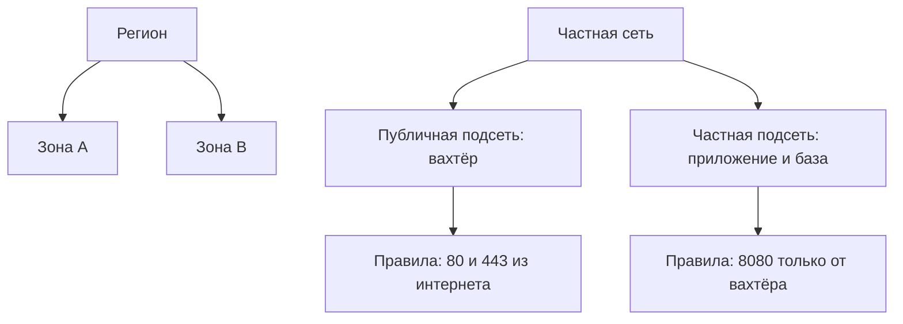

# Регионы, зоны, частная сеть и правила доступа

## Ситуация

На обычном сервере сеть просто есть: вам выдали публичный адрес, вы закрыли лишние порты и работаете.

В большом облаке порядок обратный: сначала рисуют частную сеть, потом помещают в неё машину. Пока эта картинка не сложилась в голове, панель управления выглядит как лес кнопок без смысла.

## Зачем это нужно

Понятий немного, и все они географические или бытовые.

| Понятие | Что это | Бытовой аналог |
|---|---|---|
| Регион | город или агломерация с дата-центрами | выбор «Москва или Петербург» у хостера |
| Зона доступности | отдельное здание внутри региона | второй корпус того же завода |
| Частная сеть | ваш собственный диапазон адресов в облаке | квартира |
| Подсеть | часть этой сети | комната в квартире |
| Правила доступа | какие порты и откуда открыты | ваш `ufw` |

Регион выбирают по двум причинам: задержка до пользователей и требования к хранению данных. Зоны нужны, чтобы авария в одном здании не выключила всё.

### Публичная и частная части

Подсети принято делить на две группы:

- **публичная** — сюда попадают запросы из интернета, здесь стоит вахтёр;
- **частная** — сюда снаружи не достучаться, здесь живут база данных и приложение.

Это ровно схема модулей 4 и 5: наружу смотрит только Caddy, приложение слушает внутренний адрес. Просто в облаке разделение нарисовано сетями, а не только правилами файрвола.

!!! danger "Платная дверь наружу для частной сети"
    Чтобы машина из частной подсети могла сама сходить в интернет (например, за обновлениями), нужен отдельный шлюз. Он тарифицируется почасово и является одной из главных причин неожиданных счетов: его заводят «на попробовать» и забывают удалить.

!!! note "Новые слова"
    - **Регион** — географическая площадка провайдера.
    - **Зона доступности** — независимая часть региона.
    - **Группа безопасности** — набор правил доступа вокруг машины. Аналог `ufw`, но правило живёт снаружи операционной системы.

## Как это устроено



Посмотрите на нижние два блока: это дословный перевод вашей схемы с Caddy и «Пульсом». Ничего принципиально нового.

<div class="placeholder-screen" markdown>
**Скриншот:** раздел частных сетей в панели облака. Смотрите на связку: сеть → подсети по зонам → таблицы маршрутов → группы безопасности.
</div>

В российских облаках эти же понятия называются по-русски: сеть, подсети, группы безопасности.

## Практика

### Шаг 1. Нарисовать свой сервер как упрощённую облачную сеть

На бумаге:

- одна публичная подсеть;
- правила доступа — это ваш `ufw` с портами 22, 80 и 443;
- приложение слушает внутренний адрес за Caddy.

**Что должно получиться:** рисунок, из которого видно, что вы уже живёте в упрощённой версии той же схемы.

### Шаг 2. Посмотреть свои правила доступа

**Где вводить:** терминал сервера (`ssh ucheb`)

```bash
sudo ufw status numbered
```

**Что должно получиться:** пронумерованный список правил. Именно это в облаке называется группой безопасности — только там правила задаются в панели, а не внутри системы.

### Шаг 3. Проверить, что приложение не торчит наружу

**Где вводить:** терминал сервера (`ssh ucheb`)

```bash
sudo ss -tlnp | grep 8080
```

**Что должно получиться:** приложение слушает `127.0.0.1:8080`, а не `0.0.0.0:8080`. Это и есть ваша «частная подсеть» в миниатюре.

### Шаг 4. Разобрать две типичные ошибки на своей схеме

Ответьте на два вопроса:

1. Что случится, если открыть порт SSH всему интернету?
2. Что случится, если база данных окажется в публичной части с открытым портом?

**Что должно получиться:** в обоих случаях ответ «перебор паролей и попытки взлома в течение часов». В облаке последствия ровно те же, просто масштаб больше.

## Проверка

- [ ] Вы не путаете регион и зону доступности.
- [ ] Понимаете разницу между публичной и частной подсетью.
- [ ] Знаете, что группа безопасности — это аналог `ufw` снаружи системы.
- [ ] Нарисовали свой сервер как упрощённую облачную сеть.
- [ ] Знаете про платный шлюз наружу.

## Частые ошибки

!!! failure "Открыть порт SSH всему интернету «на минуту»"
    Минута в интернете длится вечно: сканеры находят открытый порт за считанные минуты.

!!! failure "Поместить базу данных в публичную часть"
    Это модуль 4 в худшем виде. База не должна быть доступна снаружи вообще.

!!! failure "Завести платный шлюз и забыть"
    Он будет тарифицироваться круглосуточно, ничего при этом не делая.

!!! failure "Считать, что правила доступа заменяют права пользователей"
    Это разные замки: один про порты, другой про то, кому что разрешено. Оба нужны.

## Как это в больших командах

Заводят отдельные сети для тестовой и рабочей среды, соединяют их защищёнными каналами и запрещают прямые обращения из интернета почти ко всему.

Вам достаточно картинки «публичный край и частный задний двор».

## Итог

Частная сеть — квартира, подсети — комнаты, правила доступа — двери, зоны — корпуса. Без этой картинки машина в облаке — просто провод, воткнутый непонятно куда.

Далее: [Словарь и таблица перевода](03-slovar-i-perevod.md).

!!! info "Нагрузка на учебный VPS"
    **Две безопасные команды на чтение.**
