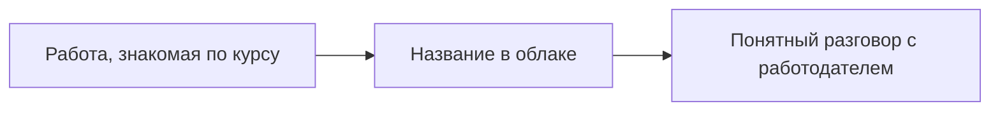

# Словарь сервисов и таблица перевода

## Ситуация

Текст вакансии выглядит как список сокращений на чужом языке: EC2, S3, RDS, IAM, ALB. Складывается впечатление, что это отдельная профессия.

На деле почти каждая из этих услуг закрывает работу, которую вы уже делали руками на своём сервере. Нужен не каталог, а таблица перевода.

## Зачем это нужно

Учить надо роли, а не названия. Ниже — зачем вообще открывают тот или иной пункт меню.

**Права доступа** отвечают на вопрос «кому что разрешено» во всём облаке: человеку, программе, самой машине. Это ваш модуль 14. Отдельная важная мысль: машине выдают роль, а не кладут на неё ключ в файл.

**Виртуальная машина и диск к ней** — это ваш сервер. Без диска машина в облаке существовать не может, ровно как ваш сервер без файловой системы.

**Правила доступа** — файрвол на уровне облачной сети. Ваш `ufw`, но правило висит снаружи.

**Хранилище объектов** — шкаф для файлов. Туда кладут копии, картинки, архивы так, чтобы они пережили смерть машины. Это модуль 6, только шкаф чужой и почти безразмерный.

**Управляемая база данных** — база, которую обновляют и копируют за вас. Нужна, когда данные стали настоящими и крутить базу рядом с сайтом на одном гигабайте больше нельзя.

**Балансировщик** — вахтёр на входе. Принимает защищённое соединение и раздаёт запросы живым машинам. Работа вашего Caddy, причём сертификат обычно живёт именно здесь.

**Служба доменных имён** — та самая запись из модуля 5, связывающая имя с адресом.

**Хранилище образов** — полка для собранных образов контейнеров, только частная.

**Запуск контейнеров без кластера** — способ крутить контейнеры по описанию, не собирая всю ферму. Ближе всего по духу к Compose, где машины даёт облако.

**Управляемый кластер** — это модуль 18, где мозг кластера обслуживает провайдер.

**Функции по событию** — кусочек кода, запускающийся на событие: положили файл — сработал скрипт. Постоянно живого процесса нет. Для сайта, который должен всё время отвечать, это неудобно.

**Логи и метрики** — облачный кабинет, где собрано то, что вы смотрели через `docker logs` и внешнюю проверку.

**Хранилище секретов** — замена файлу `.env` на диске.

### Таблица перевода

| Что вы делали сами | Название в AWS | Ориентир в российском облаке |
|---|---|---|
| Учебный сервер | EC2 и диск EBS | Compute Cloud |
| `ufw` и файрвол в панели | Security group | Группа безопасности |
| Caddy на 443 | ALB с сертификатом | Балансировщик |
| Запись DNS | Route 53 | Cloud DNS |
| Папка `data` и архив на компьютере | S3 | Object Storage |
| База в контейнере | RDS | Managed PostgreSQL |
| `docker logs` и внешняя проверка | CloudWatch | Мониторинг и логи |
| Секреты в `.env` | Secrets Manager | Lockbox |
| Образ на машине | ECR | Container Registry |
| `docker compose up` | ECS | Виртуальная машина с Compose |
| Кластер, когда понадобится | EKS | Managed Kubernetes |
| Задание в планировщике | Lambda с событиями | Cloud Functions |
| Список людей и доступов | IAM | IAM |
| Описание инфраструктуры текстом | Terraform | тот же Terraform |

!!! warning "Два замка, которые часто путают"
    Права доступа отвечают на вопрос «кто», правила сетевого доступа — на вопрос «какой порт». Это разные механизмы, и нужны оба. Правильно настроенные права не спасут от открытого наружу порта базы данных, и наоборот.

!!! note "Новые слова"
    - **Управляемый сервис** — провайдер обновляет и копирует, вы платите.
    - **Бесплатный уровень** — ограниченный бесплатный объём на время. Подробнее в следующем уроке.

## Как это устроено

Смысл таблицы не в переезде. Смысл — узнавать знакомую работу под другим именем и не платить за десять услуг, не понимая их роли.

## Практика

### Шаг 1. Восстановить таблицу по памяти

Закройте таблицу и выпишите восемь ролей: машина, диск, хранилище файлов, база, вахтёр, доменные имена, логи, права.

**Что должно получиться:** восемь строк, описанных через задачу, а не через название. Потом сверьтесь с таблицей.

### Шаг 2. Проверить себя тремя утверждениями

1. Хранилище объектов — это шкаф для файлов, а не готовый сайт.
2. Права доступа — про «кто», правила сети — про «какой порт».
3. Управляемая база нужна, когда данные настоящие, а памяти мало.

**Что должно получиться:** три утверждения, с которыми вы согласны и можете объяснить.

### Шаг 3. Найти в своём проекте то, что соответствует каждой строке

Пройдите по таблице и отметьте, что у вас уже есть, а чего нет.

**Что должно получиться:** видно, что большая часть строк закрыта — просто другими средствами. Строк, которых нет вовсе, обычно две-три.

### Шаг 4. Записать вывод

В инвентарь, одна строка:

> Каждая облачная услуга — это роль, которую я уже собирала. Перевод есть, переезд не требуется.

**Что должно получиться:** записанный вывод, снимающий тревогу при чтении вакансий.

## Проверка

- [ ] Восемь ролей восстанавливаются по памяти.
- [ ] Хранилище объектов вы не называете сайтом.
- [ ] Различаете права доступа и правила сети.
- [ ] Знаете, когда нужна управляемая база.
- [ ] Прошли по таблице применительно к своему проекту.

## Частые ошибки

!!! failure "Путать права доступа и правила сети"
    Это два разных замка на двух разных дверях.

!!! failure "Делать постоянно работающий сайт на функциях по событию"
    Первый запрос после паузы будет долгим, а время работы ограничено. Для сайта проще обычная машина.

!!! failure "Открывать услуги, не понимая их роли"
    Каждая — строка в счёте. Сначала роль, потом кнопка.

!!! failure "Учить каталог целиком"
    Двести названий не нужны. Разговор о веб-сервисе ведётся полутора десятком.

## Как это в больших командах

Используют те же основные услуги плюс несколько узкоспециальных. Каркас разговора — ровно ваша таблица.

## Итог

Перевод важнее каталога. Осталось понять, во что этот перевод обходится в деньгах.

Далее: [Счёт и бюджет](04-schet-i-budget.md).

!!! info "Нагрузка на учебный VPS"
    **Только теория.**
