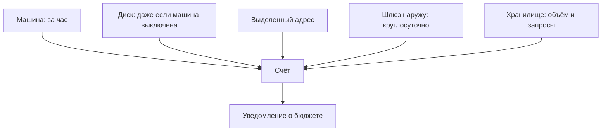

# Счёт, бюджет и бесплатный уровень

## Ситуация

У хостера вы платите понятную сумму раз в месяц. В большом облаке счёт складывается из десятков линий: за час работы машины, за гигабайт хранения, за каждый запрос, за выделенный адрес.

Типичная история: человек завёл несколько ресурсов «посмотреть», выключил машину и решил, что на этом всё. Через неделю приходит письмо с суммой, потому что диск, адрес и шлюз продолжали тарифицироваться.

Это главная опасность всего модуля, и относится она к деньгам, а не к технике.

## Зачем это нужно

Три вещи, которые надо знать до первого клика.

**Почасовая оплата.** Машину выключили — но диск и выделенный адрес продолжают стоить денег. Выключение и удаление — разные действия.

**Бесплатный уровень.** Ограниченный набор ресурсов бесплатно на время. Входит туда не всё, зависит от региона, а по истечении срока оплата начинается автоматически.

**Уведомление о бюджете.** Настройка вида «если прогноз превысит такую-то сумму — пришли письмо». Это ровно то же, что уведомление о балансе у хостера из модуля 16, и включать его нужно первым делом.

### Что продолжает тарифицироваться после выключения машины

| Ресурс | Почему живёт в счёте |
|---|---|
| Диск | хранит данные независимо от машины |
| Выделенный публичный адрес | зарезервирован за вами |
| Балансировщик | работает сам по себе |
| Шлюз для выхода наружу | тарифицируется по времени |
| Снимки дисков | занимают место |

Именно эти пять строк составляют большинство неожиданных счетов.

!!! danger "Правило лаборатории"
    Создали ресурс — потрогали — **удалили в тот же день**. Не «завтра доделаю»: завтра превратится в неделю работы шлюза.

!!! note "Новые слова"
    - **Почасовая оплата** — тариф за время существования ресурса.
    - **Бесплатный уровень** — ограниченный бесплатный объём, обычно на первый год.
    - **Уведомление о бюджете** — письмо при приближении к заданной сумме.

## Как это устроено



Порядок действий при открытии аккаунта всегда один: сначала уведомление о бюджете, потом всё остальное. Не наоборот.

## Практика

### Шаг 1. Решить, открываете ли вы аккаунт вообще

Оплата зарубежных облаков из России связана с известными сложностями.

| Ваша ситуация | Что делать |
|---|---|
| Аккаунт открыть не получается | проходите модуль чтением, это полноценный вариант |
| Аккаунт есть или получается | обязательно начните со следующего шага |

**Что должно получиться:** решение. Если аккаунта не будет — запишите в инвентарь строку «аккаунта в зарубежном облаке нет» и спокойно продолжайте. Стыдиться тут нечего.

### Шаг 2. Включить уведомление о бюджете

**Где делать:** раздел биллинга в панели облака, до любых других действий.

Укажите:

- сумму, которую не жалко увидеть в письме;
- адрес почты, который вы действительно читаете.

**Что должно получиться:** включённое уведомление. Это единственный шаг, который обязателен перед всеми остальными.

### Шаг 3. Прикинуть стоимость на калькуляторе

**Где смотреть:** публичный калькулятор цен на сайте провайдера, аккаунт для этого не нужен.

Посчитайте самую простую конфигурацию: одна небольшая машина плюс диск на 8 гигабайт.

**Что должно получиться:** сумма в месяц. Сравните её со строкой «итого» из модуля 16 — так почасовая оплата становится осязаемой.

### Шаг 4. Выписать пять опасных строк

Перенесите к себе таблицу того, что тарифицируется после выключения машины.

**Что должно получиться:** пять пунктов, по которым вы будете проходить перед закрытием учебной сессии.

### Шаг 5. Проверить свои привычки с ключами

**Зачем:** ключи доступа к облаку, попавшие в открытый репозиторий, находят автоматические сборщики в течение минут. Дальше на вашем счету появляется чужая работа.

**Где вводить:** PowerShell на вашем компьютере, в папке проекта

```powershell
git grep -I -n "AKIA"
```

**Что должно получиться:** пустой результат. Если что-то нашлось — ключ считается скомпрометированным, его надо отозвать в панели облака, а не просто удалить из файла.

## Проверка

- [ ] Решение об аккаунте принято и записано.
- [ ] Уведомление о бюджете включено, если аккаунт есть.
- [ ] Вы знаете пять ресурсов, живущих в счёте после выключения машины.
- [ ] Прикинули стоимость простой конфигурации.
- [ ] В репозитории нет ключей доступа к облаку.

## Частые ошибки

!!! failure "Считать бесплатный уровень вечным"
    Он ограничен по времени, по объёму и по региону. После окончания оплата начинается молча.

!!! failure "Завести учебный управляемый кластер на выходные"
    Управляющая часть тарифицируется независимо от того, работает ли в кластере хоть одно приложение.

!!! failure "Положить ключи доступа в репозиторий «на время теста»"
    Их найдут автоматически, и счёт будет ваш.

!!! failure "Выключить машину и считать, что расходы прекратились"
    Диск, адрес и снимки продолжают тарифицироваться.

!!! failure "Строить рабочую среду на бесплатном уровне"
    Через год конфигурация внезапно станет платной, и это будет неприятный сюрприз.

## Как это в больших командах

Ресурсы помечают, чтобы понимать, какой проект сколько тратит, задают бюджеты по командам и запрещают использование дорогих регионов.

Это тот же дух, что в модуле 16, только в масштабе компании.

## Итог

Облако умеет быстро проделать дыру в бюджете. Уведомление о деньгах настраивается раньше, чем создаётся первая машина.

Далее: [Когда облако, когда российский хостер](05-kogda-chto.md).

!!! info "Нагрузка на учебный VPS"
    **Нулевая. Расходы появляются только если вы откроете аккаунт.**
