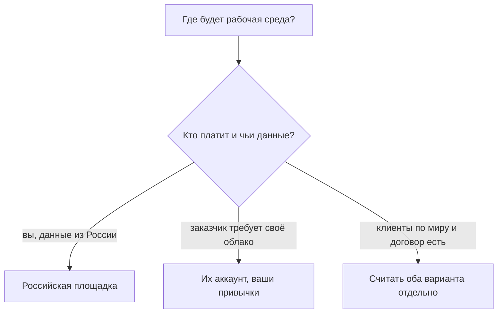

# Когда зарубежное облако, когда российский хостер, когда оба

## Ситуация

Если закончить модуль на словаре и счетах, останется ощущение «надо переезжать». Оно ложное.

Выбор площадки — это таблица ограничений, а не предпочтение логотипа. Причём большинство ограничений не технические.

## Зачем это нужно

Решение принимается по шести вопросам, и ни один из них не про то, какая технология моднее.

| Вопрос | Скорее российская площадка | Скорее зарубежное облако | Возможен смешанный вариант |
|---|---|---|---|
| Оплата и оформление договора | проще | нужен зарубежный договор | часть тут, часть там |
| Данные пользователей из России | проще объяснить | нужен разговор с юристом | данные тут, остальное вне |
| Клиенты по всему миру | одной площадки может не хватить | дата-центры рядом с людьми | раздача статики вне, основное тут |
| Заказчик требует конкретное облако | — | да | связь между площадками |
| Вы работаете одна над учебным проектом | **это ваш случай** | избыточно | нет |
| Нужна редкая услуга | может не найтись | витрина шире | узкий кусок снаружи |

Обратите внимание на пятую строку: она про вас, и ответ в ней однозначный.

### Цена смешанного варианта

Смешанный вариант выглядит привлекательно — «лучшее из двух миров». Стоит он при этом ровно вдвое дороже в обслуживании:

- две панели управления;
- две системы прав доступа;
- два счёта и два календаря оплат;
- отдельная забота о связи между площадками.

Модуль 16 придётся выполнять дважды. Это нормальная цена, если есть причина, и бессмысленная, если причины нет.

!!! warning "Порядок вопросов важен"
    Сначала закон и оплата, потом задержка до пользователей, потом требования заказчика. Технические предпочтения идут последними, а не первыми.

!!! note "Новые слова"
    - **Место хранения данных** — страна, где физически лежат данные пользователей.
    - **Смешанный вариант** — части системы у разных провайдеров.

## Как это устроено

Ключевая мысль: ваши привычки переезжают вместе с вами. Секреты вне кода, резервные копии, закрытые порты, сигналы о сбоях — всё это работает на любой площадке. Меняются только кнопки.

## Практика

### Шаг 1. Пройти по шести вопросам

Ответьте на каждый применительно к своему проекту.

**Что должно получиться:** шесть ответов. Скорее всего, пять из шести указывают на российскую площадку.

### Шаг 2. Сформулировать решение одним предложением

Запишите в инвентарь:

> Рабочая среда остаётся у такого-то хостера, потому что <причина>.

**Что должно получиться:** предложение с конкретной причиной. Если сформулировать не получается — стоит вернуться к модулю 1, где разбирался выбор хостера.

### Шаг 3. Проверить, что переезжает без изменений

Выпишите привычки, которые не зависят от площадки:

1. Секреты в отдельном файле, а не в коде.
2. Регулярные проверенные копии.
3. Закрытые порты и доступ по ключу.
4. Сигнал при недоступности.
5. Инвентарь и календарь оплат.

**Что должно получиться:** пять пунктов. Это ваш переносимый багаж — он и есть профессия, в отличие от знания конкретных кнопок.

### Шаг 4. Записать условие пересмотра

Когда вы вернётесь к этому вопросу?

**Что должно получиться:** конкретное условие вроде «если появятся клиенты за пределами России» или «если заказчик потребует». Без условия вопрос будет всплывать постоянно.

## Проверка

- [ ] Вы ответили на шесть вопросов.
- [ ] Решение записано одним предложением с причиной.
- [ ] Понимаете, что смешанный вариант удваивает обслуживание.
- [ ] Выписали привычки, которые не зависят от площадки.
- [ ] Условие пересмотра зафиксировано.

## Частые ошибки

!!! failure "Хранить данные людей где придётся, не задав вопрос юристу"
    В модуле 15 есть список из семи вопросов. Место хранения данных — один из них.

!!! failure "Завести вторую рабочую среду «на всякий случай»"
    Получите двойной счёт и расхождение данных между площадками.

!!! failure "Выбирать площадку по тому, что чаще упоминают в вакансиях"
    Вакансия не оплачивает ваш счёт и не отвечает за ваши данные.

!!! failure "Считать переезд домашним заданием курса"
    Он им не является. Задание — осознанное решение, зафиксированное письменно.

## Как это в больших командах

Решение принимают коллегиально, с учётом требований к месту хранения данных, и оформляют документом.

Вы сами себе такой совет, а документ — одно предложение в инвентаре.

## Итог

Сначала закон, оплата, задержка и требования заказчика. Логотип — в последнюю очередь.

Далее: [«Полный AWS» и Terraform](06-polnyy-aws-i-terraform.md).

!!! info "Нагрузка на учебный VPS"
    **Только теория.**
