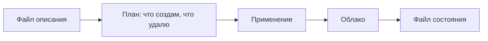

# «Полный AWS» и описание инфраструктуры текстом

## Ситуация

В вакансии написано «требуется знание полного AWS», и это звучит как требование выучить каталог из двухсот услуг.

На самом деле под этой фразой почти всегда понимают шесть слоёв. Пять из них вы уже проходили в курсе под другими именами, а шестой — умение описывать инфраструктуру текстом.

## Зачем это нужно

Вот эти шесть слоёв.

| Слой | Что в него входит | Где вы это проходили |
|---|---|---|
| Сеть | частная сеть, подсети, правила доступа | модули 4–5 |
| Права | люди, роли для машин, отсутствие ключей в репозитории | модуль 14 |
| Вычисления | машины, контейнеры или кластер — по задаче | модули 3–4, 18 |
| Данные | хранилище файлов, база, резервные копии | модуль 6 |
| Наблюдаемость | логи, метрики, уведомления, бюджет | модули 9–11, 16 |
| Инфраструктура как код | описание всего перечисленного в репозитории | новое |

Третья строка содержит важное слово: **по задаче**. Требование знать все варианты запуска сразу — признак плохо написанной вакансии, а не вашей неподготовленности.

### Инфраструктура как код

Идея та же, что и в модуле 8, только применительно к серверам.

**Было:** вы нажимаете кнопки в панели и надеетесь вспомнить, что именно нажимали.

**Стало:** вы описываете в текстовом файле, какая машина нужна и какие порты открыты. Файл лежит в репозитории, изменения видны в истории, повторное применение приводит реальность в соответствие с описанием.

Инструмент для этого называется Terraform (у него есть открытый вариант OpenTofu). Один и тот же язык умеет работать с разными облаками — меняется только подключаемый модуль.

!!! danger "Файл состояния — секрет"
    Terraform хранит отдельный файл с описанием того, что уже создано. Там встречаются идентификаторы и следы вашей инфраструктуры. В публичный репозиторий он не попадает никогда.

!!! note "Новые слова"
    - **Инфраструктура как код** — описание серверов и сетей текстом в репозитории.
    - **План** — предварительный показ того, что будет создано и что удалено.
    - **Файл состояния** — запись о том, что уже существует в облаке.

## Как это устроено



Ключевой шаг здесь — план. Он показывает намерения до того, как что-то произойдёт. Применять описание без просмотра плана — то же самое, что запускать незнакомую команду на рабочем сервере.

!!! warning "Про пример в курсе"
    В папке `labs/cloud/server.tf.example` лежит учебный файл: одна машина, вход по SSH только с вашего адреса, порты 80 и 443. Это перевод вашей связки «сервер плюс `ufw`» в текст.

    **Применять его не нужно**, пока не настроено уведомление о бюджете и пока вы не готовы удалить всё в том же сеансе.

## Практика

### Шаг 1. Расшифровать вакансию

Возьмите любую вакансию со словами про облако и разложите требования по шести слоям.

**Что должно получиться:** большинство пунктов попадёт в слои, которые вам знакомы. Обычно по-настоящему новым оказывается один — описание инфраструктуры текстом.

### Шаг 2. Прочитать учебный файл описания

**Где смотреть:** файл `labs/cloud/server.tf.example` в папке курса.

Найдите в нём три вещи:

- описание машины — это ваш сервер;
- правила доступа — это ваш `ufw`;
- метки — это строка в инвентаре.

**Что должно получиться:** узнавание. Файл описывает ровно то, что вы настраивали руками в модулях 1 и 2.

### Шаг 3. Проговорить порядок работы

Запишите последовательность:

1. Изменить файл описания.
2. Посмотреть план.
3. Прочитать, что будет удалено.
4. Применить.
5. В конце учебной сессии — удалить всё созданное.

**Что должно получиться:** пять шагов. Третий пункт — самый важный: удаление чего-то нужного видно именно в плане.

### Шаг 4. Записать правило про удаление заранее

Запишите обязательство ещё до регистрации где-либо:

> Любая учебная сессия в облаке заканчивается удалением всех созданных ресурсов.

**Что должно получиться:** записанное правило. Записанное заранее оно работает лучше, чем принятое в момент усталости после часа кликов.

### Шаг 5. Проверить, что файл состояния не попадёт в репозиторий

**Где вводить:** PowerShell на вашем компьютере, в папке проекта

```powershell
Select-String -Path .gitignore -Pattern "tfstate"
```

**Что должно получиться:** найденная строка. Если её нет — добавьте `*.tfstate*` в `.gitignore` до того, как начнёте что-либо создавать.

## Проверка

- [ ] Вы расшифровываете «полный AWS» шестью слоями.
- [ ] Понимаете идею описания инфраструктуры текстом.
- [ ] Знаете, зачем нужен план перед применением.
- [ ] Знаете, что файл состояния — секрет.
- [ ] Правило об удалении записано заранее.

## Частые ошибки

!!! failure "Применить чужой пример из интернета без просмотра плана"
    Получите неожиданный счёт и, вполне вероятно, открытые наружу порты.

!!! failure "Положить файл состояния в публичный репозиторий"
    Это подробная карта вашей инфраструктуры для посторонних.

!!! failure "Выучить десяток модных услуг и не разобраться с сетью"
    Разговор о работе обычно начинается именно с сети и прав доступа.

!!! failure "Начинать с описания текстом, не потрогав панель"
    Сначала стоит понять, что вообще создаётся. Потом это описывается.

## Как это в больших командах

Изменения инфраструктуры проходят через обсуждение в репозитории: сначала автоматика показывает план, потом человек одобряет применение. Ручные клики в рабочей среде обычно запрещены.

Это ровно смысл модуля 8, перенесённый на серверы.

## Итог

«Полный AWS» — это шесть слоёв плюс умение описать их текстом. Пять слоёв у вас уже есть.

Далее: [Лаборатория. Консоль без забытых ресурсов](../../labs/lab-19-konsol-i-terraform.md).

!!! info "Нагрузка на учебный VPS"
    **Нулевая.**
