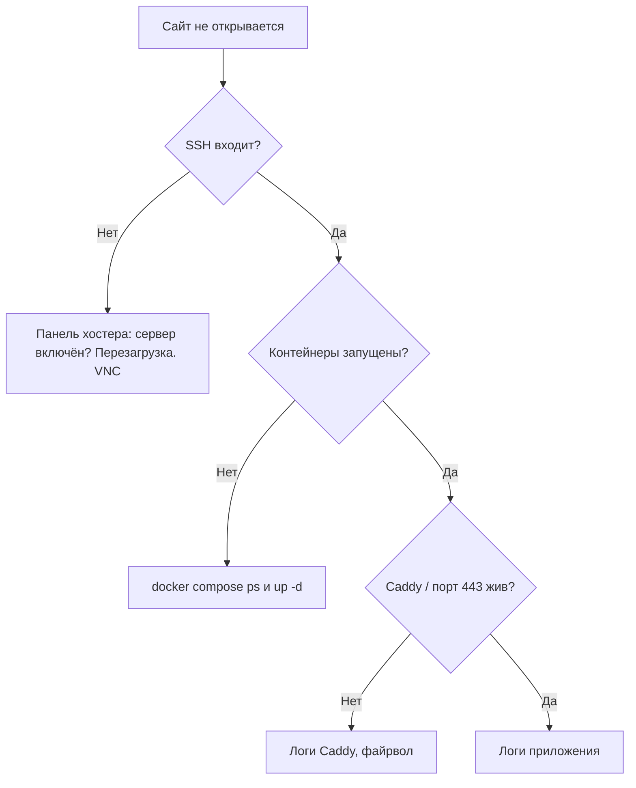

# Runbook: сайт не открывается

**Сигнал:** вы или знакомый не можете открыть адрес. Или позже — алерт в Telegram.

**Нагрузка:** эта карточка рассчитана на учебный VPS 1 ГБ. Не ставьте ради неё Grafana.

## 1. Сдержать (чтобы не сделать хуже)

- Не переустанавливайте Ubuntu «с чистого листа» в первую минуту.
- Не меняйте DNS, если вчера всё открывалось — сначала проверьте сервер.

## 2. Быстрая развилка



## 3. Команды

С вашего компьютера:

```bash
ssh deploy@ВАШ_IP
```

На сервере:

```bash
free -h
df -h
cd /opt/pulse
docker compose ps
docker compose logs --tail=100
```

Если памяти нет (`available` около нуля) — смотрите [диск и память](disk-full.md) и [страницу VPS](../lab-server.md). Часто «сайт умер», потому что закончилась RAM.

С телефона можно только открыть IP в браузере и панель хостера. SSH — с компьютера.

## 4. Когда поднимается

Запишите в блокнот: *что увидели*, *что сделали*, *сколько длилось*. Это зародыш postmortem (разбор без самобичевания) — модуль 12.

Связанные уроки: [ошибки деплоя](../modules/m04/04-oshibki-deploy.md), [порты](../modules/m04/03-porty.md).
